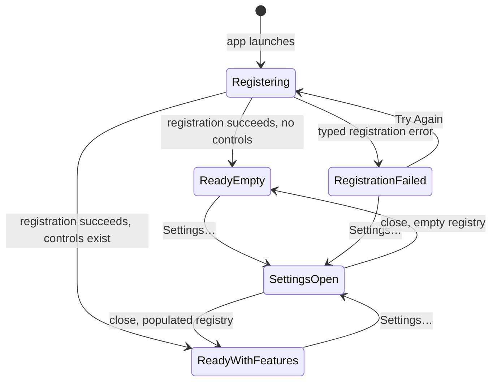

# 01 — Project Foundation

## Metadata

| Field | Value |
|---|---|
| ID | `01` |
| Classification | Required platform |
| Specification status | Ready |
| Implementation status | Not started |
| Dependencies | None |

## Goal

Establish a warning-free Swift 6 SwiftPM application under `app/` that runs on
macOS 13 or later on Intel and Apple Silicon. The result is a terminal-built
menu-bar application named Displayora, with a popover-style `MenuBarExtra`, a
separate Settings scene, no permanent Dock icon, a transactional
`FeatureRegistry`, compile-time selection of independently buildable features,
and a runnable isolated feature test host.

The foundation also supplies one-command development validation and a real,
universal `Displayora.app`. The bundle is assembled from separate `arm64` and
`x86_64` release builds, combined with `lipo`, checked, and ad-hoc signed. No
`.xcodeproj`, Xcode GUI workflow, or `xcodebuild` invocation is part of the
project.

## Non-Goals

- This specification does not discover displays or access display hardware;
  Specification 03 owns those services and their fake adapters.
- It does not define detailed onboarding, launch-at-login behavior, or the
  finished shell layout; Specification 02 builds those experiences on these
  scenes and contribution interfaces.
- It does not implement Brightness, Contrast, Volume and Mute, Resolution,
  Keyboard Controls, Disable and Re-enable Display, or Night Comfort.
- It does not create a DMG, use Developer ID signing, enable the Hardened
  Runtime, notarize, or staple an artifact; Specification 11 owns release
  packaging.
- It does not use private macOS APIs, request a system permission, persist
  settings, or introduce a third-party dependency.
- It does not create an Xcode project as a generated convenience. SwiftPM and
  the root `Makefile` are the only supported project entry points.

## User Experience and States

Launching `Displayora.app` creates a menu-bar item with the visible name
“Displayora” and the SF Symbol `display.2`. It uses a window-style
`MenuBarExtra`, which behaves as a small popover, and an independent SwiftUI
`Settings` scene. `LSUIElement` is `true`, so launch does not create a
permanent Dock icon. The executable must not change activation policy at
runtime.

While contributions are registered, the popover reads “Loading display
controls…”. Successful registration moves to one of two generic states:

- an empty registry reads “No display controls are included in this build.”
  and still offers a “Settings…” button and “Quit Displayora”;
- a non-empty registry renders contributions in stable order and offers the
  same settings and quit actions.

The empty text describes the build, not missing hardware, and therefore does
not impersonate the no-display state owned by Specification 02. A registration
failure reads “Displayora couldn’t load its controls.” followed by the
non-sensitive error description and buttons for “Try Again”, “Settings…”, and
“Quit Displayora”. Retry reconstructs a new registry from the unchanged
installed-feature list; it never retains a partially registered feature.

The Settings scene always opens, including for empty and failed compositions.
Before Specification 02 adds settings, it shows the product title and either
“No settings are included in this build.” or the registered settings
contributions. Omitted features are never named in the popover or Settings.
On macOS 14 and later, the button uses SwiftUI's `openSettings` action. On
macOS 13, a focused `SettingsOpening` AppKit adapter sends
`showSettingsWindow:` and reports whether AppKit accepted the action; the
dynamic selector is confined to that availability fallback and is covered by
an adapter test.



## Requirements

### Project and module structure

- **DORA-01-001 — SwiftPM platform.** Create `app/Package.swift` with
  `// swift-tools-version: 6.0`, Swift language mode 6, and
  `.macOS(.v13)`. The package has no external dependencies. All production
  Swift sources and tests live below `app/Sources` and `app/Tests`. Tests use
  the toolchain-provided Swift Testing module; the package has no external
  runtime dependencies.
- **DORA-01-002 — Stable target graph.** The package defines
  `DisplayoraCore`, `DisplayoraUI`, and `DisplayoraComposition` library
  targets; `Displayora` and `DisplayoraFeatureTestHost` executable targets;
  and focused test targets for Core, UI, composition, the app model, and the
  feature host. Dependencies flow
  `Core <- UI <- Composition <- executables`. A later system target may depend
  on Core, but Core never imports UI, system adapters, or a feature module.
- **DORA-01-003 — Terminal-only repository.** The supported workflow uses
  `swift`, `swift format`, Python 3 validation scripts, `make`, `lipo`,
  `plutil`, and `codesign` from the terminal. The repository contains no
  `.xcodeproj` or `project.pbxproj`, and scripts must not call `xcodebuild` or
  require Xcode GUI state.

### Application shell and contribution contracts

- **DORA-01-004 — Menu-bar scenes.** `Displayora` is a SwiftUI `@main`
  executable with one window-style `MenuBarExtra` and one `Settings` scene.
  `app/Support/Info.plist` sets bundle identifier
  `com.displayora.Displayora`, executable and product name `Displayora`,
  minimum system version `13.0`, `LSUIElement` to `true`,
  `NSHighResolutionCapable` to `true`, short version `0.1.0`, and build
  version `1`.
- **DORA-01-005 — Feature contract.** `DisplayoraUI` exposes an
  `@MainActor` `DisplayoraFeature` protocol with a stable static `FeatureID`
  and a throwing `makeContributions() -> FeatureContributions` method.
  `FeatureContributions` contains ordered arrays of controls, settings,
  capability declarations, and commands. Contributions have a stable ID,
  owning feature ID, novice-readable label, accessibility label, and stable
  sort order. Control and settings contributions use `@MainActor` SwiftUI view
  factories; command actions are `@MainActor`, asynchronous, and throwing.
- **DORA-01-006 — Transactional registry.** An `@MainActor`
  `FeatureRegistry` validates and commits one feature’s complete
  `FeatureContributions` atomically. It rejects an invalid or duplicate
  feature, control, setting, capability, or command ID with a typed,
  user-presentable `FeatureRegistrationError`; an error leaves the registry
  byte-for-byte equivalent to its state before that feature was attempted.
  Registry snapshots expose immutable, deterministically sorted values to
  views and tests. Registration never performs hardware work.
- **DORA-01-007 — Main-actor application model.** A small `@MainActor`
  application model owns the registry and the `registering`, `ready`, or
  `failed(FeatureRegistrationError)` launch state. Retry creates and loads a
  new registry. Views remain declarative and contain no composition,
  registration, bundle, or process logic.

### Standalone selection and test host

- **DORA-01-008 — Deterministic feature selection.** `Package.swift` accepts
  `DISPLAYORA_FEATURES` as a comma-separated list of canonical feature slugs.
  Empty means no optional features. Whitespace, duplicate slugs, empty
  elements, and unknown slugs fail manifest evaluation with a precise error.
  For each selected implemented feature, the manifest adds only that target to
  `DisplayoraComposition` dependencies and defines its corresponding
  `DISPLAYORA_FEATURE_<NAME>` compilation condition. Conditional imports and
  constructors live only in `DisplayoraComposition`; platform and sibling
  feature targets never import one another.
- **DORA-01-009 — Omission is complete.** With
  `DISPLAYORA_FEATURES=''`, the app builds, tests, bundles, and launches with
  an empty registry. An omitted optional feature contributes no target
  dependency, import, constructor, control, setting, capability, command,
  shortcut, label, placeholder, or resource to the app product.
- **DORA-01-010 — Isolated feature host.**
  `DisplayoraFeatureTestHost` uses the same `DisplayoraComposition` selection,
  loads a registry without launching SwiftUI, requires exactly one installed
  feature, and emits a deterministic JSON snapshot of feature, control,
  setting, capability, and command IDs. It exits nonzero for zero, multiple,
  invalid, or failed registrations. Foundation tests compose a local fixture
  feature in the same registry and test the empty composition. The root
  `scripts/verify_feature.py` accepts the canonical verification scopes
  `foundation`, `shell`, `display-platform`, `release`, and the seven
  optional-feature slugs listed below. It rejects unknown or not-yet-implemented
  scopes and uses an isolated scratch directory. Optional-feature scopes select
  exactly one optional module, run its focused tests and shared regressions,
  execute the host with `--expect-feature`, and run architecture validation.
  Platform and release scopes run their specification-defined focused
  targets/fixtures and architecture validation without invoking the
  one-installed-feature host.

### Terminal commands and validation

- **DORA-01-011 — Make contract.** The root `Makefile` provides these
  non-interactive targets with the following fixed meanings:
  `doctor` checks Swift 6, `swift format`, Python 3, `make`, `lipo`, `otool`,
  `plutil`, and `codesign`; `check-specs` validates documentation;
  `check-architecture` rejects forbidden dependency and Xcode artifacts;
  `check-review SPEC=NN` validates durable review evidence; `build` builds the
  selected debug app; `test` runs selected focused and regression tests;
  `format` performs strict lint without modifying files; `run` runs the
  selected app; `bundle` produces and validates the universal app; `verify`
  runs doctor, specification, formatting, build, test, architecture, and
  bundle checks; `verify-feature FEATURE=<name>` performs the isolated verification scope
  defined by DORA-01-010; and `clean` removes only known SwiftPM and bundle outputs
  below `app/.build` and `dist`.

  `doctor` is a terminal-tool check only: it does not require Xcode, an Xcode
  project, Xcode GUI state, `xcodebuild`, or XCTest. Swift Testing is used by
  the focused SwiftPM test targets, so `make test` remains runnable with the
  Swift Command Line Tools and does not require the full Xcode application.
- **DORA-01-012 — Compiler quality gates.** Every debug, test, per-architecture
  release, and feature-host build uses warnings as errors and complete strict
  concurrency checking. Package language mode remains Swift 6. `swift format
  lint --recursive --strict` covers the manifest, sources, and tests. Test
  code may not relax compiler flags used by production code.
- **DORA-01-013 — Automated coverage.** Swift Testing covers registry success,
  deterministic order, every duplicate-ID class, invalid ownership, atomic
  rollback, retry after failure, empty composition, one fixture-feature
  composition, JSON host snapshots, and shell state transitions.
  Dependency-free Python checks cover target direction, selected-feature
  isolation, absent sibling imports, forbidden Xcode artifacts, Info.plist
  values, universal architectures, signing, and the absence of unresolved
  build-path dependencies.

### Universal application bundle

- **DORA-01-014 — Separate architecture builds.** `scripts/build-app.sh`
  invokes two independent release builds, one with `--arch arm64` and one with
  `--arch x86_64`, using distinct scratch paths. It passes the same selected
  feature set and strict compiler flags to both. It must never derive one
  architecture by copying or translating the other.
- **DORA-01-015 — Real and rollback-safe app assembly.** The bundle script assembles
  a temporary `Displayora.app/Contents/{MacOS,Resources}`, copies the locked
  Info.plist to `Contents/Info.plist`, combines the two `Displayora`
  executables with `lipo -create`, and verifies that the result contains
  exactly `arm64` and `x86_64`. It rejects non-system load paths into
  `.build`, checks the plist with `plutil`, ad-hoc signs with
  `codesign --force --sign - --timestamp=none`, and verifies with
  `codesign --verify --deep --strict`. Only after all checks pass does it
  perform a rollback-safe replacement of `dist/Displayora.app`; a failure
  restores and preserves the last valid bundle.
- **DORA-01-016 — Native architecture behavior.** The universal app must
  launch natively on both an Intel Mac and an Apple Silicon Mac running macOS
  13 or later, show the same empty or selected composition, open Settings, and
  remain absent from the Dock. Rosetta-only evidence is insufficient for the
  Apple Silicon check, and a translated Intel process is insufficient for the
  Intel check.

### User safety and implementation approval

- **DORA-01-017 — Accessibility and permissions.** Every foundation label,
  button, error, and contribution container has a stable accessibility label;
  status is conveyed in text and not color alone; keyboard focus follows
  visual order; controls meet standard macOS contrast; and no essential state
  change depends on animation. The foundation requests no Accessibility,
  Screen Recording, Location, Audio, or other TCC permission and has no
  entitlement file.
- **DORA-01-018 — Independent approval gate.** Before implementation can be
  `Verified`, a Codex reviewer different from the implementation author must
  review the full diff, requirements, tests, shared interfaces, and validation
  evidence in `specs/reviews/01-project-foundation-review.md`. Codex
  automatically repairs all in-scope findings and repeats validation and
  independent review until Blocking findings remaining are zero and the final
  verdict is `Approved`.

## Interfaces and Data Flow

### Required file and target layout

Implementation uses this minimum layout. Additional files may split a listed
type into a focused file, but may not change the boundaries or names below.

```text
app/
├── Package.swift
├── Support/
│   └── Info.plist
├── Sources/
│   ├── DisplayoraCore/
│   ├── DisplayoraUI/
│   ├── DisplayoraComposition/
│   ├── Displayora/
│   └── DisplayoraFeatureTestHost/
└── Tests/
    ├── DisplayoraCoreTests/
    ├── DisplayoraUITests/
    ├── DisplayoraCompositionTests/
    ├── DisplayoraTests/
    └── DisplayoraFeatureTestHostTests/
scripts/
├── build-app.sh
├── check_architecture.py
├── check_bundle.py
└── verify_feature.py
dist/
└── Displayora.app
```

`dist/` and all SwiftPM scratch directories are ignored by Git. The Info.plist,
source, test, manifest, and scripts are tracked.

### Core identifiers

`DisplayoraCore` owns `FeatureID`, `ControlID`, `SettingID`, `CapabilityID`,
and `CommandID`. Each is a distinct `RawRepresentable`, `Hashable`,
`Comparable`, `Codable`, `Sendable` value type over a non-empty namespaced
string. Valid strings match
`^[a-z][a-z0-9]*(?:[.-][a-z0-9]+)*$`; feature-owned IDs begin with
`<feature-id>.`. The Core module also owns immutable `Sendable` capability and
command metadata that contain no closures or SwiftUI types.

### UI contracts and registry

`DisplayoraUI` imports Core and SwiftUI. Its public surface is:

```swift
@MainActor
public protocol DisplayoraFeature {
    static var id: FeatureID { get }
    func makeContributions() throws -> FeatureContributions
}

@MainActor
public struct FeatureContributions {
    public let featureID: FeatureID
    public let controls: [ControlContribution]
    public let settings: [SettingContribution]
    public let capabilities: [CapabilityContribution]
    public let commands: [CommandContribution]
}

@MainActor
public final class FeatureRegistry {
    public init()
    public func register(_ feature: any DisplayoraFeature) throws
    public var snapshot: FeatureRegistrySnapshot { get }
}
```

The concrete contribution initializers are public and validate label, owner,
ID, and order invariants. Control and setting factories return `AnyView`;
command actions are `() async throws -> Void`. Those closures and the registry
remain main-actor isolated. `FeatureRegistrySnapshot` is an immutable
main-actor value used by SwiftUI and includes only sorted contribution values.
Sorting uses numeric order first, then stable ID, so source and registration
order cannot change rendering or JSON evidence.

Registration follows this one-way transaction:

```text
installed feature value
  -> makeContributions()
  -> validate owner, labels, IDs, and duplicates against a staged copy
  -> commit staged snapshot once
  -> application model publishes ready state
  -> SwiftUI renders snapshot
```

If creation or validation throws, the staged copy is discarded and the prior
snapshot is unchanged. `FeatureRegistrationError` has explicit cases for
feature construction, malformed identifiers, owner mismatch, empty labels,
duplicate feature, duplicate control, duplicate setting, duplicate
capability, and duplicate command. Its localized text includes safe IDs but
never an underlying debug dump.

### Composition

`DisplayoraComposition` is the only production target allowed to import a
feature module. It exposes:

```swift
@MainActor
public func makeInstalledFeatures() -> [any DisplayoraFeature]
```

`Package.swift` owns one canonical mapping per implemented optional feature:

| Selection slug | SwiftPM target | Compilation condition |
|---|---|---|
| `brightness` | `BrightnessFeature` | `DISPLAYORA_FEATURE_BRIGHTNESS` |
| `contrast` | `ContrastFeature` | `DISPLAYORA_FEATURE_CONTRAST` |
| `volume-and-mute` | `VolumeFeature` | `DISPLAYORA_FEATURE_VOLUME` |
| `resolution-selector` | `ResolutionFeature` | `DISPLAYORA_FEATURE_RESOLUTION` |
| `keyboard-controls` | `KeyboardControlsFeature` | `DISPLAYORA_FEATURE_KEYBOARD_CONTROLS` |
| `disable-and-reenable-display` | `DisplayStateFeature` | `DISPLAYORA_FEATURE_DISPLAY_STATE` |
| `night-comfort` | `NightComfortFeature` | `DISPLAYORA_FEATURE_NIGHT_COMFORT` |

A catalog entry becomes selectable only in the same implementation commit that
adds its module and tests. The manifest sorts selected slugs before creating
dependencies and compilation conditions, so equivalent input order produces
the same package graph. The app and feature host receive the same composition
target. No runtime plug-in loading, reflection, service locator, or
feature-to-feature discovery is allowed.

### Executables

The `Displayora` executable creates its model on the main actor, immediately
registers `makeInstalledFeatures()`, and injects the resulting state into the
popover and Settings roots. The executable contains no feature imports.

The host accepts exactly:

```text
DisplayoraFeatureTestHost --expect-feature <canonical-slug>
```

It verifies that the selected slug maps to the single registered `FeatureID`,
serializes a sorted snapshot with `JSONEncoder.outputFormatting =
[.sortedKeys]`, prints one JSON document to standard output, and exits `0`.
Usage, selection, count, registration, or encoding failures write a concise
message to standard error and use distinct nonzero exit codes.

## Failure and Recovery

- Malformed or unknown `DISPLAYORA_FEATURES` input stops at manifest
  evaluation. The error names the invalid token and prints the canonical
  choices; it never silently selects a default.
- A registration failure is typed, is presented without a crash, and cannot
  expose a partial feature. “Try Again” discards the failed registry and
  replays the deterministic installed list once per user activation; no
  automatic retry loop runs.
- If Settings cannot be opened from the popover, the button remains enabled
  and the app logs one privacy-safe error through `Logger`; the popover stays
  usable. No foundation failure terminates the app except an explicit Quit.
- `build-app.sh` uses `mktemp -d` below `dist/`, installs a cleanup trap, and
  writes no output over the current app until architecture, plist, load-path,
  and signature validation all pass. If an existing app is present, the
  installation phase moves it to one explicit sibling backup, installs the
  validated staging app, restores the backup if installation fails, and
  deletes the backup only after final validation at the destination. A failed
  build exits nonzero and reports the failed phase.
- `clean` resolves and checks the repository root, then removes only the
  explicit `app/.build` and `dist` paths. It rejects empty, root, home, or
  unresolved targets.
- There is no display state to restore in this specification. Normal
  termination, forced termination, sleep, and wake therefore cannot leave a
  hardware or color change behind.

## Accessibility and Permissions

The menu item is announced as “Displayora”. Loading, empty, ready, and failed
states are exposed as text with live status semantics appropriate to SwiftUI;
repeated retry does not move VoiceOver focus away from the retry button unless
registration succeeds. All icon-only presentation has an accessibility label.
Popover traversal is title, status or contributions, Settings, then Quit.
Settings traversal follows registered stable order.

All actions are reachable by keyboard. Settings uses the standard Command-Comma
command, Quit uses Command-Q, and no custom global shortcut is installed. The
empty and error text remains legible with Increase Contrast, Reduce
Transparency, and Reduce Motion. Foundation animation is limited to the
system-provided popover transition and is not needed to understand state.

This foundation has no code path that requests Accessibility or another TCC
permission. It ships no usage-description key and no entitlement file. Later
features must add permission behavior only in their own specifications and
only when selected.

## Platform Considerations

- The deployment target is macOS 13.0 for all targets. APIs newer than macOS
  13 require explicit availability checks and a macOS 13 behavior.
- `MenuBarExtra` is available at the minimum deployment target. AppKit may be
  used only for small, isolated macOS integration adapters; application and
  settings content remains SwiftUI.
- Intel and Apple Silicon use the same source, package graph, Info.plist,
  feature set, and resources. Architecture-specific `#if arch(...)` behavior
  is prohibited in the foundation unless it exists solely to report test
  evidence.
- Each release slice is compiled natively for its target architecture before
  `lipo`; an Apple Silicon development machine may cross-compile the Intel
  slice and an Intel development machine may cross-compile the Apple Silicon
  slice. Final native launch evidence still comes from one machine of each
  architecture.
- The bundle script fails if the selected toolchain or installed macOS SDK
  cannot produce either slice. It does not fall back to a thin application.
- HDR, display sleep/wake, hot-plug, and control restoration are inert at this
  layer because no display is opened or modified.
- The foundation uses no private API. Later private APIs remain isolated and
  availability checked under their owning specification.

## Standalone and Omission Behavior

For foundation-only verification, the empty app and local fixture composition
are exercised with:

```sh
DISPLAYORA_FEATURES='' make verify
DISPLAYORA_FEATURES='' make verify-feature FEATURE=foundation
```

`FEATURE=foundation` is a platform verification scope. It builds and tests
Core, UI, Composition, and `DisplayoraFeatureTestHost` in an isolated
`app/.build/feature-foundation` scratch path, runs the host’s
  empty-composition failure assertion, runs the local one-feature fixture
  composition Swift Testing suite, and runs `make check-architecture`. It does not register
the fixture in the production app.

The other non-feature scopes are `shell`, `display-platform`, and `release`.
They run the focused targets and fixtures defined by Specifications 02, 03, and
11 in isolated scratch paths. They do not call
`DisplayoraFeatureTestHost --expect-feature`, because none represents one
installed optional feature.

After an optional module is implemented, its standalone command is:

```sh
make verify-feature FEATURE=<canonical-slug>
```

The verifier sets `DISPLAYORA_FEATURES` to exactly that slug, uses
`app/.build/feature-<canonical-slug>`, builds the module and test host with
strict flags, runs only its test target plus shared platform regression tests,
runs the host with `--expect-feature`, and invokes architecture validation.
It fails if a sibling feature target, source import, contribution, or test is
required.

Omission is verified with an explicitly empty environment value, not by an
unset developer default. In that build, there are no optional target
dependencies or feature compilation conditions; `makeInstalledFeatures()`
returns an empty array; the registry contains no optional controls, settings,
capabilities, or commands; and UI snapshots contain no feature-specific
placeholder or label. A later intentionally omitted module may remain in the
repository for other selections, but it is not linked into or referenced by
the empty application product.

## Acceptance Criteria and Traceability

| Criterion | Requirements | Given / When / Then | Verification |
|---|---|---|---|
| `AC-01-01` | `DORA-01-001`, `DORA-01-003` | Given a clean checkout with the documented tools, When the package manifest and repository are inspected and `make build` runs, Then Swift 6 builds for macOS 13+ without dependencies, Xcode projects, GUI state, or `xcodebuild`. | `TEST-01-01` |
| `AC-01-02` | `DORA-01-002` | Given the package target graph, When architecture validation runs, Then dependencies flow from Core through UI and Composition to executables and no reverse or sibling edge exists. | `TEST-01-02` |
| `AC-01-03` | `DORA-01-004` | Given the empty selected set, When the app launches, Then one named menu-bar popover and a separate Settings scene are available and no permanent Dock icon appears. | `MANUAL-01-03` |
| `AC-01-04` | `DORA-01-005`, `DORA-01-006` | Given valid and invalid fixture features, When their contributions are registered, Then all four contribution categories are sorted and exposed for the valid feature while every invalid or duplicate case throws its typed error without partial state. | `TEST-01-04` |
| `AC-01-05` | `DORA-01-007` | Given initial, successful, and failed registrations, When the application model loads or retries, Then it publishes the specified main-actor state and replaces rather than mutates a failed registry. | `TEST-01-05` |
| `AC-01-06` | `DORA-01-008`, `DORA-01-009` | Given empty, valid single-feature, reordered multi-feature, duplicate, whitespace, empty-element, and unknown feature selections, When SwiftPM evaluates composition, Then valid selections are deterministic and invalid selections fail precisely while omitted features have no product reference. | `TEST-01-06` |
| `AC-01-07` | `DORA-01-010` | Given each platform/release scope and one implemented optional feature selected alone, When `make verify-feature` runs, Then the correct isolated tests pass; optional scopes also produce the expected one-feature host JSON; and no unintended sibling is built or imported. | `TEST-01-07` |
| `AC-01-08` | `DORA-01-011` | Given the root Makefile, When each documented target is invoked with valid input and invalid required arguments are sampled, Then every target has the fixed behavior and failures are non-interactive and actionable. | `TEST-01-08` |
| `AC-01-09` | `DORA-01-012` | Given all source and test targets, When formatting, debug build, test, release-slice, and host builds run, Then strict Swift 6 concurrency passes and every compiler warning is treated as an error. | `TEST-01-09` |
| `AC-01-10` | `DORA-01-013` | Given the required Swift Testing and Python suites, When `make test` and `make check-architecture` run, Then every listed registry, state, composition, dependency, plist, bundle, and path invariant has an executable assertion. | `TEST-01-10` |
| `AC-01-11` | `DORA-01-014` | Given a toolchain able to target both architectures, When `make bundle` runs, Then separate arm64 and x86_64 release invocations produce two distinct input binaries for `lipo`. | `TEST-01-11` |
| `AC-01-12` | `DORA-01-015` | Given no prior bundle and then a known-good prior bundle, When bundling succeeds and a forced validation failure is tested, Then the successful output is a valid universal ad-hoc-signed app and the failure preserves the known-good output. | `TEST-01-12` |
| `AC-01-13` | `DORA-01-016` | Given the same universal bundle on native Intel and Apple Silicon hosts, When it is launched and inspected, Then each host runs its native slice, shows equivalent menu and Settings behavior, and has no Dock icon. | `MANUAL-01-13` |
| `AC-01-14` | `DORA-01-017` | Given VoiceOver, keyboard navigation, Increase Contrast, Reduce Transparency, and Reduce Motion, When loading, empty, populated-fixture, and failure states are exercised, Then all state and actions remain named, ordered, legible, and operable without any permission prompt. | `MANUAL-01-14` |
| `AC-01-15` | `DORA-01-018` | Given completed implementation and validation, When a different Codex agent reviews and any findings are automatically repaired, Then repeated review records zero Blocking findings, all checks, and `Approved` before the tracker becomes `Verified`. | `TEST-01-15` |

## Verification

### Automated commands

Run from the repository root with a Swift 6 command-line toolchain selected.
These commands are exact; none may be replaced with `xcodebuild`. The doctor,
production build, bundle, installation, and SwiftPM test workflows do not
require the full Xcode application.

```sh
make doctor
make check-specs
DISPLAYORA_FEATURES='' make format
DISPLAYORA_FEATURES='' make build
DISPLAYORA_FEATURES='' make test
DISPLAYORA_FEATURES='' make check-architecture
DISPLAYORA_FEATURES='' make verify-feature FEATURE=foundation
DISPLAYORA_FEATURES='' make bundle
DISPLAYORA_FEATURES='' make verify
python3 scripts/check_bundle.py dist/Displayora.app
lipo -archs dist/Displayora.app/Contents/MacOS/Displayora
codesign --verify --deep --strict --verbose=2 dist/Displayora.app
plutil -lint dist/Displayora.app/Contents/Info.plist
git diff --check
```

Expected `lipo -archs` output contains `x86_64 arm64` in either order and no
other token. `check_bundle.py` is the authoritative order-independent
assertion. `make verify` must rebuild the bundle; it is not allowed to accept a
stale artifact.

`scripts/build-app.sh` must execute the equivalent of these exact slice
commands, preserving the caller's validated `DISPLAYORA_FEATURES` value:

```sh
swift build --package-path app --configuration release --arch arm64 \
  --scratch-path app/.build/bundle-arm64 \
  -Xswiftc -warnings-as-errors -Xswiftc -strict-concurrency=complete
swift build --package-path app --configuration release --arch x86_64 \
  --scratch-path app/.build/bundle-x86_64 \
  -Xswiftc -warnings-as-errors -Xswiftc -strict-concurrency=complete
lipo -create <arm64-bin-path>/Displayora <x86_64-bin-path>/Displayora \
  -output <staging-app>/Contents/MacOS/Displayora
```

The script obtains each `<architecture-bin-path>` by rerunning `swift build
--show-bin-path` with the identical package, configuration, architecture,
scratch-path, and compiler arguments. Angle-bracket values above are resolved
absolute paths printed to the build log, not shell input accepted from a user.

Run the negative selection cases; every command must exit nonzero and print
the invalid input:

```sh
DISPLAYORA_FEATURES='unknown' swift package --package-path app describe
DISPLAYORA_FEATURES='brightness,brightness' swift package --package-path app describe
DISPLAYORA_FEATURES=' brightness' swift package --package-path app describe
DISPLAYORA_FEATURES='brightness,' swift package --package-path app describe
make check-review SPEC=01
```

Before implementation is `Verified`, the final command is expected to explain
that review approval is not yet present. After the independent review is
approved and the tracker is updated, run:

```sh
make check-review SPEC=01
```

It must pass using `specs/reviews/01-project-foundation-review.md`.

The test identifiers map to executable evidence as follows:

| Test ID | Automated evidence |
|---|---|
| `TEST-01-01` | `make doctor`, package manifest tests, and forbidden-project/script scans in `make check-architecture` |
| `TEST-01-02` | package graph assertions in `scripts/check_architecture.py` |
| `TEST-01-04` | `DisplayoraUITests/FeatureRegistryTests` |
| `TEST-01-05` | `DisplayoraTests/ApplicationModelTests` on the main actor |
| `TEST-01-06` | `DisplayoraCompositionTests` plus manifest subprocess cases |
| `TEST-01-07` | all four platform/release scope invocations plus each implemented optional-feature invocation |
| `TEST-01-08` | `MakeContractTests`, which invokes safe targets in a temporary fixture repository |
| `TEST-01-09` | `make format`, `make build`, `make test`, and both strict release slice builds inside `make bundle` |
| `TEST-01-10` | `make test` and `make check-architecture`, including coverage-manifest assertions for required cases |
| `TEST-01-11` | bundle log assertions and distinct-slice checks in `scripts/check_bundle.py` |
| `TEST-01-12` | temporary-output success and injected pre-install validation-failure integration tests for `build-app.sh` |
| `TEST-01-15` | `make check-review SPEC=01` after tracker approval |

### Manual evidence mapping

| ID | Required evidence |
|---|---|
| `MANUAL-01-03` | Steps 1–5 below on the empty selected build, recording the menu-bar item, popover, Settings window, Dock absence, and clean quit |
| `MANUAL-01-13` | The architecture commands and Steps 1–5 below on both native Intel and native Apple Silicon using the identical bundle |
| `MANUAL-01-14` | The assistive-technology and display-option repetition described after Steps 1–5 |

### Manual native verification

Perform the following once on a native Intel Mac and once on a native Apple
Silicon Mac, both running macOS 13 or later, using the same produced app:

```sh
uname -m
file dist/Displayora.app/Contents/MacOS/Displayora
open dist/Displayora.app
ps -axo pid,arch,comm | grep '[D]isplayora.app/Contents/MacOS/Displayora'
```

On Intel, `uname -m` and the running process report `x86_64`; on Apple Silicon,
they report `arm64`. On each machine:

1. Confirm the menu-bar item is announced and displayed as “Displayora”.
2. Open the popover and confirm the empty-build message, Settings, and Quit.
3. Open Settings with the button and Command-Comma; confirm the independent
   window and foundation empty-settings message.
4. Confirm Displayora is absent from the Dock while the menu-bar process
   remains running.
5. Quit with Command-Q and confirm the menu item and process disappear.

Record OS version, hardware model, `uname -m`, process architecture, bundle
SHA-256, and pass/fail for each step in the implementation review report.

For `MANUAL-01-14`, repeat the empty and a test-build populated-fixture state
with VoiceOver, Full Keyboard Access, Increase Contrast, Reduce Transparency,
and Reduce Motion. Trigger the fixture registration error and retry. Record
announced labels, traversal order, visible error text, focus behavior, and
confirmation that System Settings showed no new permission request.

## Code Quality and Automatic Review

Implementation must comply with [CODE_REVIEW.md](CODE_REVIEW.md). It uses
idiomatic, straightforward Swift 6; clear names and small, focused types and
functions; value types by default; protocols only at meaningful system or
testing boundaries; declarative SwiftUI; `@MainActor` UI state; safe
`Sendable` values across concurrency boundaries; typed recoverable errors; and
isolated, availability-checked private APIs. It prohibits premature
abstraction, unnecessary generic layers, oversized view models,
sibling-feature coupling, `try!`, unexplained force unwraps, silent error
suppression, crash-based control flow, and warning suppression. Comments
explain intent, recovery invariants, or API hazards instead of restating code.

All builds must be warning-free. Formatting, focused tests, full regression
tests, `make check-architecture`, strict concurrency checks, foundation
standalone composition, empty-feature omission, both architecture slices, and
bundle validation must pass.

Before commit, a different Codex reviewer examines this specification and its
acceptance criteria, the complete working-tree diff, all new and changed
tests, relevant shared interfaces, and captured build, test, formatting,
architecture, bundle, strict-concurrency, standalone, omission, Intel, and
Apple Silicon results. The reviewer writes
`specs/reviews/01-project-foundation-review.md` from the review template. Every
round records blocking and non-blocking findings, affected requirement IDs and
files, required corrections, automatic fixes, and exact validation
commands/results.

Codex automatically fixes every in-scope blocking finding. It also
automatically fixes scope-preserving non-blocking findings that improve
readability, idiomatic Swift, safety, Accessibility, or maintainability. Codex
must not gain approval by weakening tests or acceptance criteria, deleting
coverage, suppressing warnings, hiding errors, or broadening exclusions. After
repairs, Codex reruns the focused checks and the full `make verify` regression
suite, and the same independent reviewer examines the updated complete diff.

Review and repair repeat until every acceptance criterion passes, no blocking
finding remains, and the report contains the literal lines
`Blocking findings remaining: 0` and `Final verdict: Approved`. A finding that
requires a product decision or specification change makes implementation
`Blocked`; Codex must not invent broader behavior. Only after
`make check-review SPEC=01` passes may code review become `Approved`,
implementation become `Verified`, and the coordinator create
`feat(spec-01): implement project foundation`.

## Author Self-Review

### Pass 1 — Completeness and User Safety

The first pass found that a package skeleton alone did not specify how a
failed feature registration avoids partially visible controls, how a failed
bundle protects an existing app, or what a novice sees in an empty build. The
revision made registry registration transactional with typed errors, defined
the registering/empty/populated/failure states and a bounded user-triggered
retry, and required temporary bundle assembly with validation before atomic
replacement. It also added destructive-path guards to `clean` and explicit
native launch evidence instead of treating a universal header as sufficient.

### Pass 2 — Independence and Verifiability

The second pass found ambiguity in feature selection and in the phrase
“isolated feature test host”: a build could have linked every sibling and
merely hidden registrations. The revision locked canonical selection slugs,
manifest validation, conditional target dependencies and imports, an
executable one-feature JSON host, isolated scratch paths, foundation fixture
coverage, and explicit empty-selection checks. It then mapped every
requirement to Given/When/Then criteria and named automated or manual evidence,
added exact strict-concurrency and universal-bundle commands, and made
independent Codex review plus automatic repair a prerequisite for `Verified`.

## Pull Request Handoff

Open a dedicated draft PR with a plain-language foundation and workflow
summary, the locked target boundaries, validation results, and any native
architecture evidence still requiring human confirmation.
