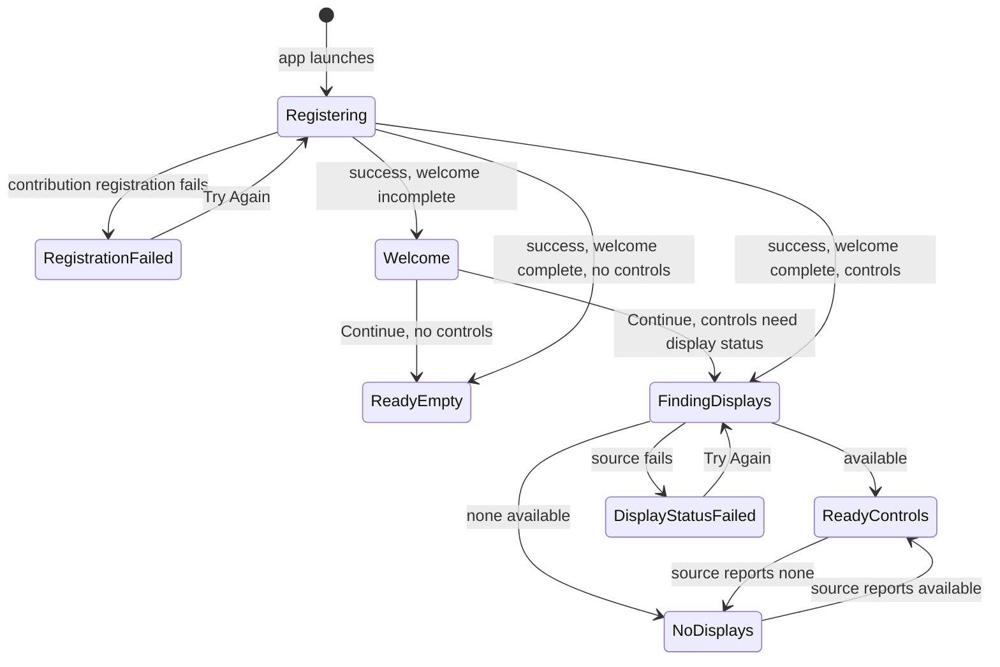

# 02 — Menu-Bar Shell and Onboarding

## Metadata

| Field | Value |
|---|---|
| ID | `02` |
| Classification | Required platform |
| Specification status | Ready |
| Implementation status | Not started |
| Dependencies | `01` |

## Goal

Deliver the minimal novice-friendly shell: menu-bar popover, separate
Settings, one-step welcome, launch at login, and clear loading, empty,
no-display, and recoverable-error states. It presents installed features only
through Specification 01 contributions, works with an empty or single-feature
composition, and gives Specification 03 a narrow display-status presentation
boundary without implementing display behavior.

## Non-Goals

- Display discovery, hot-plug, sleep/wake, probing, control selection, and
  hardware/software adapters belong to Specification 03.
- It does not add a user-facing Brightness, Contrast, Volume and Mute,
  Resolution, Keyboard Controls, Display State, or Night Comfort behavior.
- It requests no TCC permission; Accessibility onboarding belongs to
  Specification 08's native media keys.
- It does not offer login launch during welcome, enable it by default, nag for
  approval, or install legacy helpers, agents, or daemons.
- It adds no search, reordering, favorites, detachable popover, telemetry,
  notification, analytics, or always-visible window.
- It does not change the activation policy at runtime, create a permanent Dock
  icon, or combine Settings into the menu-bar popover.
- It does not change the four contribution categories, ownership validation,
  transactional registration, or compile-time feature selection established
  by Specification 01.

## User Experience and States

The “Displayora” menu item retains the `display.2` symbol. Its 320-point-wide,
vertically scrolling popover is headed “Displayora” and has a 480-point
visible-height cap. It uses standard SwiftUI controls and exposes no internal
IDs or adapter terminology. On the first successful registry load for a new
installation, it shows:

- the heading “Your displays, made simple”;
- “Displayora lives in the menu bar. Open it here whenever you want to adjust
  an included display control.”;
- a primary “Continue” button; and
- the always-available “Settings…” and “Quit Displayora” actions.

Continue records per-user completion and reveals normal content without
closing the popover. Completion persists across upgrades and launch-at-login
changes. Welcome claims no feature or display is present and requests no
permission. Before registration completes, show “Loading display controls…”.
Welcome is considered only after successful registration. After welcome:

- with no registered controls, show “No display controls are included in this
  build.”; do not start display-status observation;
- with controls and a display-status source still starting, show “Looking for
  displays…” and retain the feature labels in a disabled, non-interactive
  control area;
- with controls and one or more available displays, render controls in
  registry order, with dividers between independently owned controls;
- with controls and no usable connected display, show “No displays available”
  and “Connect or wake a display. Displayora will update automatically.”;
- after a recoverable display-status failure, show “Displayora can’t check
  your displays right now.” and the buttons “Try Again” and “Settings…”;
- after a registry failure, show the Specification 01 text “Displayora
  couldn’t load its controls.” and its “Try Again”, “Settings…”, and “Quit
  Displayora” actions.

The status source chooses only these four presentations; it supplies no
controls, hardware diagnostics, or availability policy. Its Try Again calls
the source once and never rebuilds the registry. The separate “Displayora
Settings” window has General, stable-order feature settings, and About.
General contains “Launch Displayora at login”, off by default. About shows
product name, version, build, bundle ID, and the tagline, with no device IDs.
Omitted feature settings leave no placeholder.

Settings and Command-Comma activate the same singleton window; closing it
does not quit. Command-Q and Quit Displayora terminate normally.



## Requirements

### Shell composition and presentation

- **DORA-02-001 — Minimal scene behavior.** Preserve the single
  window-style `MenuBarExtra`, separate singleton `Settings` scene,
  `LSUIElement=true`, menu item name, and symbol from Specification 01.
  Runtime code must not call `setActivationPolicy`, manufacture a Dock icon,
  or create another long-lived window.
- **DORA-02-002 — Deterministic contribution presentation.** The popover
  invokes registered `ControlContribution` view factories in the immutable
  registry snapshot order. Settings invokes `SettingContribution` factories
  in snapshot order between General and About. Platform wrappers may add a
  label, divider, padding, focus target, disabled state, and accessibility
  grouping, but may not inspect a feature module type, rewrite the contributed
  control, or branch on a known feature ID.
- **DORA-02-003 — Empty and single-feature composition.** An empty registry
  renders the exact build-empty message, General, About, Settings, and Quit,
  with no feature placeholder. A one-fixture-feature registry renders each of
  its controls and settings exactly once and no UI belonging to any sibling
  feature.
- **DORA-02-004 — Shared presentation roots.** `DisplayoraUI` owns reusable
  `MenuBarRoot` and `SettingsRoot` SwiftUI views plus immutable
  `MenuBarPresentation`, `SettingsPresentation`, `ShellAction`, and
  `ShellDisplayStatus` values. Features continue to communicate only through
  Specification 01 contributions. The executable owns navigation and model
  state; feature modules cannot present Settings, quit the application, or
  change shell state directly.

### Onboarding and state handling

- **DORA-02-005 — First-run welcome.** A typed `WelcomeCompletionStoring`
  boundary reads and writes the standard user-defaults Boolean key
  `onboarding.hasCompletedWelcome.v1`. Missing or false means incomplete.
  Completion is written only after “Continue”; successful writing updates the
  UI immediately. A write failure leaves welcome visible, announces “Displayora
  couldn’t save this choice.”, and permits another user-initiated attempt.
- **DORA-02-006 — Loading and registration failure.** Registration loading,
  transactional failure, and retry retain the Specification 01 semantics and
  exact primary text. Loading never exposes interactive feature controls.
  Registration retry re-reads welcome completion only after a new registry
  succeeds and never invokes display-status retry.
- **DORA-02-007 — Display-status boundary.** `DisplayoraUI` declares a
  `Sendable`, equatable `ShellDisplayStatus` with `loading`, `available`,
  `noDisplays`, and `failed(ShellDisplayStatusFailure)` cases.
  `ShellDisplayStatusFailure` contains a stable non-sensitive code and one
  novice-readable recovery message, not an underlying error or display
  identifier. `Displayora` declares a `Sendable` asynchronous
  `ShellDisplayStatusProviding` protocol that yields an initial status and
  subsequent status values and supports a user-requested `retry() async`.
  Specification 03 supplies the production implementation; this specification
  supplies deterministic fakes only.
- **DORA-02-008 — No-display and display-error presentation.** The shell
  subscribes to the optional status provider only after registration succeeds,
  welcome is complete, and at least one control contribution exists.
  `loading`, `noDisplays`, and `failed` render the exact behaviors above;
  `available` renders registered controls. Repeated identical updates do not
  reset keyboard or VoiceOver focus. Cancelling or replacing the shell model
  cancels its observation task. No automatic retry loop runs.
- **DORA-02-009 — State precedence.** State precedence is registration
  loading/failure, first-run welcome, empty build, then display status. This
  ordering is centralized in one small `@MainActor` shell model. Views do not
  start tasks, persist values, register features, or decide precedence.

### Launch at login

- **DORA-02-010 — Modern login-item adapter.** `DisplayoraSystem` is added as
  a dependency-free SwiftPM library target depending only on
  `DisplayoraCore` and Apple frameworks. An isolated
  `LaunchAtLoginManaging` adapter uses `SMAppService.mainApp` on macOS 13+,
  calls `register()` or `unregister()` only after direct user toggle
  activation, and maps `SMAppService.Status` to `disabled`, `enabled`,
  `requiresApproval`, or `unavailable`. Legacy login-item APIs, helper bundles,
  launch agents, and silent auto-registration are prohibited.
- **DORA-02-011 — Honest launch-at-login UI.** The General toggle initially
  reflects the queried service status and is disabled only while a requested
  change is in flight. Success re-queries the service instead of assuming the
  requested value. A register or unregister failure restores the queried
  value and shows the inline, dismissible text “Displayora couldn’t update
  this setting.” `requiresApproval` leaves the toggle off and shows “Allow
  Displayora in Login Items to finish setup.” with an “Open Login Items
  Settings…” button that calls
  `SMAppService.openSystemSettingsLoginItems()`. The app does not poll, nag,
  or claim approval succeeded.
- **DORA-02-012 — Login-item reconciliation.** Launch-at-login status is
  re-queried when General appears, whenever the app becomes active, and after
  every register/unregister attempt. Revocation or an external status change
  therefore corrects the UI without altering welcome completion or feature
  state. Launching because macOS started the registered login item uses the
  same menu-bar-only state and does not automatically open the popover or
  Settings window.

### Accessibility, safety, and platform

- **DORA-02-013 — Keyboard and VoiceOver.** Every platform heading, status,
  action, toggle, contributed row wrapper, and Settings destination has a
  stable accessibility label. Focus order follows visual order. Status
  changes are announced once through accessibility status semantics; error
  recovery retains focus on “Try Again” or the login toggle until the state
  changes successfully. All shell and Settings actions work with Full Keyboard
  Access.
- **DORA-02-014 — Visual accessibility.** Text, standard controls, separators,
  focus rings, and disabled content remain understandable with VoiceOver,
  Increase Contrast, Reduce Transparency, Reduce Motion, and 200% interface
  scaling. Meaning is never conveyed by color, symbol, animation, or disabled
  state alone. The popover scrolls instead of clipping at large text sizes.
- **DORA-02-015 — Permission restraint.** Neither onboarding nor
  launch-at-login requests a TCC permission. The shell contains no permission
  probe, usage-description key, Accessibility deep link, or permission-shaped
  modal. The only system-navigation action in this specification opens Login
  Items Settings after `requiresApproval` is reported.
- **DORA-02-016 — Architecture parity and approval.** The same source,
  persistence key, ServiceManagement behavior, presentation states, and
  tests apply on native Intel and Apple Silicon Macs running macOS 13+.
  Before implementation is `Verified`, a different Codex reviewer must approve
  `specs/reviews/02-menu-bar-shell-and-onboarding-review.md` under the
  automatic gate below.

## Interfaces and Data Flow

### Target additions and ownership

Specification 02 adds shell presentation roots under `DisplayoraUI`,
launch-at-login and welcome stores under a new `DisplayoraSystem` library, and
the shell model/status boundary under `Displayora`, with matching UI, System,
and executable tests. It adds no optional feature target.

System imports Core and Apple frameworks, never UI, Composition, or a feature.
UI imports Core and SwiftUI. The executable composes UI, System, Composition,
and injected adapters:

```text
DisplayoraCore <- DisplayoraUI <- DisplayoraComposition <- Displayora
       ^                                              /
       └──────────── DisplayoraSystem ────────────────
```

Architecture validation rejects UI↔System edges, feature-to-feature edges, and
concrete feature imports outside Composition.

### Shared shell values

The required conceptual public surface is:

```swift
public enum ShellDisplayStatus: Equatable, Sendable {
    case loading
    case available
    case noDisplays
    case failed(ShellDisplayStatusFailure)
}

public struct ShellDisplayStatusFailure: Equatable, Sendable {
    public let code: String
    public let recoveryMessage: String
}

public enum ShellAction {
    // Continue; both retries; Settings; Login Items; dismiss; quit.
}
```

`MenuBarPresentation` and `SettingsPresentation` are immutable main-actor
values containing the registry snapshot, resolved state, and typed actions.
They may not become dictionaries, notifications, environment singletons, or
feature-ID switches. Inherited view factories stay `@MainActor`.

The executable-side boundary is:

```swift
public protocol ShellDisplayStatusProviding: Sendable {
    func statusUpdates() -> AsyncStream<ShellDisplayStatus>
    func retry() async
}
```

The stream yields its current value first. Production passes `nil` until
Specification 03 supplies a source. `nil` is valid only for no controls; a
debug precondition and composition test reject controls plus `nil`, avoiding
an invented available or no-display result.

### Persistence and launch at login

`WelcomeCompletionStoring` exposes throwing `isComplete()` and
`markComplete()`. Production receives an injected `UserDefaults`; tests use
and delete a unique suite. Only the fixed Boolean is accessed; corrupt data is
a typed failure. `LaunchAtLoginManaging` has query, enable, and disable
operations with typed errors and wraps only `SMAppService.mainApp`. Tests use
a fake facade and never change the host's login items. Adapter work stays off
the rendering path; published state remains main-actor isolated.

Data moves in one direction:

```text
installed features -> transactional registry -> immutable snapshot
                                           \-> @MainActor ShellModel
welcome store --------------------------------^       |
optional status stream -----------------------^       v
launch-at-login adapter -> Settings state ----^  MenuBarRoot / SettingsRoot
```

Views emit typed actions; only the model invokes retries, persistence,
Settings, login-item operations, or termination.

## Failure and Recovery

- A welcome-store read failure shows incomplete welcome plus “Displayora
  couldn’t load your saved welcome choice.” Continue attempts a normal write;
  failure keeps welcome visible and never touches unrelated defaults.
- Registration errors retain Specification 01 atomic replacement and one
  user-triggered retry, outrank later states, and hide contributions.
- Unexpected stream end becomes `failed` once with code
  `status-stream-ended`. Other implementation errors map to safe codes; raw
  errors, adapter details, EDID data, serials, and debug text stay private.
- Display Try Again is disabled until its one call returns or status changes.
  Failure keeps the error visible. Specification 03 emits reconnect updates;
  the shell has no timer or polling loop.
- If Settings opening fails, the popover stays open and Specification 01's
  safe logging applies; activation policy does not change.
- On login-item failure, re-queried truth wins and another toggle can retry.
  `requiresApproval` is not failure and never auto-opens System Settings.
- Normal quit cancels status observation. No display/color state is changed,
  so termination, sleep, or wake has nothing to restore.

## Accessibility and Permissions

The menu item is announced “Displayora”. Popover order is title,
welcome/status, available controls, Settings, Quit. Settings order is sidebar,
selected heading, content, inline status. Wrappers use contribution
accessibility labels, never internal owner IDs.

Loading and availability are status text. First no-display or failure
transitions announce politely; duplicates do not. Successful retry moves focus
to the first control; failures retain Try Again. Welcome failure retains
Continue. Login errors retain the toggle; approval guidance and its button
follow it.

System styling and vertical scrolling preserve content at large sizes. Reduce
Motion removes authored transitions. No information uses the symbol alone.

Login-item approval is not TCC. Nothing invokes `AXIsProcessTrusted`, requests
Accessibility, adds privacy usage text, or opens Privacy & Security. The Login
Items button appears only for `requiresApproval`.

## Platform Considerations

- All new targets deploy to macOS 13.0. `SMAppService.mainApp` is the only
  launch-at-login mechanism and is available at the deployment target.
  Later APIs require an explicit availability check and a macOS 13 path.
- UI, persistence, and ServiceManagement use identical Intel/Apple Silicon
  code; architecture conditional compilation is prohibited.
- Native checks verify Settings/login operations create no Dock icon. Rosetta
  is not native Apple Silicon evidence.
- Display status is presentation-only; HDR, identity, lifecycle, probing, and
  recovery remain Specification 03 work.
- This specification uses no private API. Its AppKit Settings-opening fallback
  remains the isolated macOS 13 adapter defined by Specification 01.

## Standalone and Omission Behavior

Specification 02 is required platform code, not an optional feature. Its
focused verification is:

```sh
DISPLAYORA_FEATURES='' make verify-feature FEATURE=shell
```

`FEATURE=shell` builds Core, UI, System, Composition, the app model, tests, and
feature host in `app/.build/feature-shell`. It composes an empty registry and
a test-only fixture with one control and setting; the fixture is never in the
manifest, product, or `makeInstalledFeatures()`.

Empty verification covers welcome and platform UI without starting status
observation. The fixture covers every status, retry, and cancellation. It
fails on any sibling target, import, UI, command, or resource.

The required shell is not omittable. An empty optional set leaves generic
shell, welcome, login setting, and About, but no feature control, setting,
name, shortcut, capability, command, import, or placeholder. Omitting one
later feature removes only its contributions; omitted features are never
named.

## Acceptance Criteria and Traceability

| Criterion | Requirements | Given / When / Then | Verification |
|---|---|---|---|
| `AC-02-01` | `DORA-02-001`, `DORA-02-004` | Given the shell app is running, When the menu item, popover, Settings action, and app windows are exercised, Then there is one compact popover, one separately activated Settings window, and no permanent Dock icon or runtime activation-policy change. | `TEST-02-01`, `MANUAL-02-01` |
| `AC-02-02` | `DORA-02-002`, `DORA-02-003` | Given empty and one-fixture-feature snapshots, When menu and Settings presentations are created, Then empty UI names no feature and the fixture's ordered controls and settings appear exactly once without feature-ID branching or sibling content. | `TEST-02-02` |
| `AC-02-03` | `DORA-02-005` | Given missing, false, true, corrupt, and write-failing welcome storage, When the shell loads and Continue is activated, Then only incomplete state shows welcome, successful completion persists, and each failure remains visible and recoverable with the specified text. | `TEST-02-03` |
| `AC-02-04` | `DORA-02-006`, `DORA-02-009` | Given every registration, welcome, empty-build, and display status combination, When the shell resolves presentation state or registration retry runs, Then the defined precedence and exact loading/error text are deterministic and the two retry paths remain separate. | `TEST-02-04` |
| `AC-02-05` | `DORA-02-007`, `DORA-02-008` | Given a one-feature registry and a fake status stream, When loading, available, no-display, repeated, failure, retry, stream-end, and model-cancellation events occur, Then the shell shows the specified state, runs one explicit retry, preserves focus on duplicates, and cancels observation without performing display logic. | `TEST-02-05` |
| `AC-02-06` | `DORA-02-010` | Given fake ServiceManagement states and operations, When the launch-at-login adapter queries, enables, or disables, Then every status and typed error maps correctly, no operation occurs before user action, and no legacy mechanism is referenced. | `TEST-02-06` |
| `AC-02-07` | `DORA-02-011`, `DORA-02-012` | Given enabled, disabled, requires-approval, unavailable, operation-failure, app-activation, and login-launch cases, When General is used, Then the toggle reflects re-queried truth, approval guidance is honest, external changes reconcile, and no window opens automatically. | `TEST-02-07`, `MANUAL-02-07` |
| `AC-02-08` | `DORA-02-013`, `DORA-02-014`, `DORA-02-015` | Given VoiceOver, Full Keyboard Access, accessibility display options, and every shell state, When the app is navigated at 200% scaling, Then all state and actions are labeled, ordered, visible, operable, announced without repetition, and no TCC prompt appears. | `TEST-02-08`, `MANUAL-02-08` |
| `AC-02-09` | `DORA-02-016` | Given the same universal app on native Intel and Apple Silicon Macs, When empty, welcome, Settings, login-item, and fixture-equivalent shell paths are checked, Then behavior matches without Rosetta dependence, private APIs, or architecture branches. | `MANUAL-02-09` |
| `AC-02-10` | `DORA-02-002`, `DORA-02-003`, `DORA-02-016` | Given `DISPLAYORA_FEATURES=''` and shell fixture verification, When focused, architecture, and full-regression checks run, Then the empty and single-feature compositions pass, optional sibling features remain absent, and a different Codex reviewer records Approved only after automatic repairs leave zero Blocking findings. | `TEST-02-10` |

## Verification

### Automated commands

Run from the repository root:

```sh
make doctor
make check-specs
DISPLAYORA_FEATURES='' make format
DISPLAYORA_FEATURES='' make build
DISPLAYORA_FEATURES='' make test
DISPLAYORA_FEATURES='' make verify-feature FEATURE=foundation
DISPLAYORA_FEATURES='' make verify-feature FEATURE=shell
DISPLAYORA_FEATURES='' make check-architecture
DISPLAYORA_FEATURES='' make bundle
DISPLAYORA_FEATURES='' make verify
python3 scripts/check_bundle.py dist/Displayora.app
git diff --check
```

The shell verifier uses its scratch path, platform/shell tests, empty host, and
empty/fixture compositions, rejecting optional production features. Fakes
must not alter host defaults, login items, or Settings.
`make check-architecture` also scans for `LSSharedFileList`,
`LSSharedFileListItem`, launch-agent plist creation, `SMLoginItemSetEnabled`,
`setActivationPolicy`, feature-ID switches in shell sources, optional-feature
imports outside Composition, UI-to-System imports, and System-to-UI imports.

The evidence mapping is:

| Test ID | Automated evidence |
|---|---|
| `TEST-02-01` | `DisplayoraUITests/ShellSceneContractTests` plus Info.plist and source scans in `make check-architecture` |
| `TEST-02-02` | `DisplayoraUITests/ShellPresentationTests` and `DisplayoraTests/ShellCompositionTests` |
| `TEST-02-03` | `DisplayoraSystemTests/WelcomeCompletionStoreTests` and `DisplayoraTests/ShellModelWelcomeTests` |
| `TEST-02-04` | table-driven `DisplayoraTests/ShellModelPrecedenceTests` and `ShellModelRegistrationRetryTests` |
| `TEST-02-05` | `DisplayoraTests/ShellDisplayStatusTests` with a controllable `AsyncStream` fake |
| `TEST-02-06` | `DisplayoraSystemTests/LaunchAtLoginManagerTests` with a fake service facade |
| `TEST-02-07` | `DisplayoraTests/LaunchAtLoginSettingsTests` and app lifecycle reconciliation tests |
| `TEST-02-08` | accessibility identifier, label, focus-order, scrollability, duplicate-announcement, and permission-call source assertions in UI and architecture tests |
| `TEST-02-10` | `make verify-feature FEATURE=shell`, `make check-architecture`, `make verify`, and the final approved review check |

Before implementation is `Verified`, this command is informational and passes
with “report not required” because the tracker does not yet claim completion:

```sh
make check-review SPEC=02
```

After implementation, automatic fixes, rerun validation, and final independent
review, set the tracker to implementation `Verified` and code review
`Approved`. The same command must then validate and pass using
`specs/reviews/02-menu-bar-shell-and-onboarding-review.md`; a Verified row
without that approved evidence must fail.

### Manual macOS verification

Using one disposable-user native Intel Mac and Apple Silicon Mac on macOS 13+
and the same universal app:

```sh
uname -m
file dist/Displayora.app/Contents/MacOS/Displayora
open dist/Displayora.app
ps -axo pid,arch,comm | grep '[D]isplayora.app/Contents/MacOS/Displayora'
```

1. Confirm Intel reports `x86_64`, Apple Silicon `arm64`, and the app appears
   only in the menu bar.
2. Verify loading, first-run copy, no permission prompt, Continue persistence,
   and VoiceOver/keyboard order through welcome, Settings, and Quit.
3. Verify empty text names no feature; Settings and Command-Comma activate one
   General/About window and closing it does not quit.
4. Enable launch at login. If approval is required, verify exact guidance and
   that Login Items Settings opens only from its button.
5. Log out/in and verify approved startup opens no window or Dock icon; disable
   and verify no startup. Revoke externally and verify app activation
   reconciles General without resetting welcome. Finish disabled.
6. Check representative welcome, empty, no-display, and error fixture states
   with Increase Contrast, Reduce Transparency/Motion, and 200% scaling.
7. Confirm native Kind/process evidence; Rosetta or translated evidence does
   not satisfy the respective architecture.

## Code Quality and Automatic Review

Implementation must comply with [CODE_REVIEW.md](CODE_REVIEW.md). It uses
idiomatic, straightforward Swift 6; clear names and focused types/functions;
value types by default; protocols only at the persistence, ServiceManagement,
display-status, and testing boundaries; declarative SwiftUI; `@MainActor` UI
state; safe `Sendable` values; typed recoverable errors; and no display
business logic in views.

Premature abstraction, unnecessary generics, oversized view models,
stringly-typed action routing, feature-ID branches, sibling-feature coupling,
`try!`, unexplained force unwraps, silent error suppression, crash-based
control flow, warning suppression, and legacy launch-item APIs are prohibited.
The reviewer must specifically examine task cancellation, stream termination,
UserDefaults isolation, service-state reconciliation, accessibility focus,
empty and single-feature omission, and the absence of display logic owned by
Specification 03.

Before commit, a Codex reviewer different from the implementation author
examines this specification, the complete working-tree diff, new and changed
tests, shared interfaces, and captured format, build, test, strict concurrency,
architecture, standalone, bundle, and full-regression results. The reviewer
writes
`specs/reviews/02-menu-bar-shell-and-onboarding-review.md` with every review
round, blocking and non-blocking findings, affected requirement IDs and
files, required corrections, automatic fixes, and exact validation results.

Codex automatically repairs every in-scope blocking finding and every
scope-preserving non-blocking finding that improves readability, idiomatic
Swift, safety, accessibility, or maintainability. It then reruns all focused
and full-regression commands above. Tests or acceptance criteria may not be
weakened, coverage deleted, warnings or errors hidden, or exclusions broadened
to obtain approval.

The same independent reviewer examines the corrected complete diff again.
Review and automatic repair repeat until every acceptance criterion passes,
no blocking finding remains, and the report contains the literal lines
`Blocking findings remaining: 0` and `Final verdict: Approved`. A finding that
requires a product decision or specification change makes implementation
`Blocked`; Codex must not invent broader product behavior. Only then may
implementation and review move to `Verified` and `Approved`, respectively,
and only then may the coordinator commit.

## Author Self-Review

### Pass 1 — Completeness and User Safety

The first pass found that “first run”, “no display”, and “error” could overlap
without a deterministic result, and that an eager display provider could make
an empty build scan hardware unnecessarily. The revision added the explicit
state precedence in `DORA-02-009`, delayed status subscription until welcome
completion and a non-empty control registry in `DORA-02-008`, and separated
registry retry from display-status retry. It also specified exact welcome
persistence failures, stream termination, launch-item approval, revocation,
and user-triggered recovery so the shell never lies about success or retries
indefinitely.

### Pass 2 — Independence and Verifiability

The second pass found that a shell-level no-display state risked absorbing
display discovery from Specification 03 and that launch-at-login tests could
mutate the developer's machine. The revision reduced the boundary to
`ShellDisplayStatusProviding`, required Specification 03 to own its production
implementation, prohibited display IDs and adapter policy in the shell, and
made controls-plus-`nil` invalid in composition tests. It introduced the fake
ServiceManagement facade and volatile defaults suite, defined forbidden-edge
architecture scans, added exact empty and single-fixture verification, and
made native Intel and Apple Silicon evidence and the independent Codex
automatic-repair approval gate traceable.
