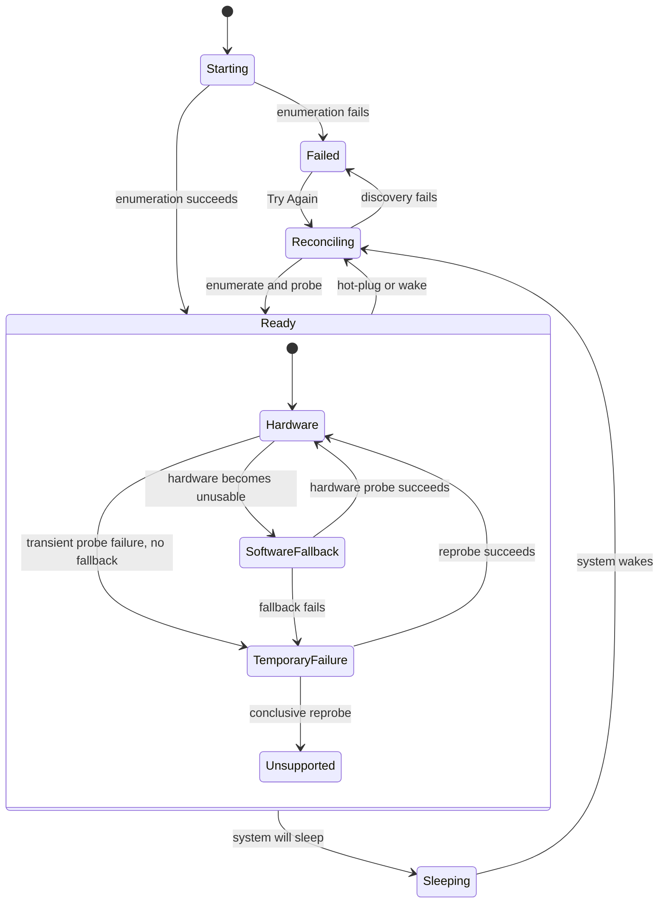

# 03 — Display Platform and Capabilities

## Metadata

| Field | Value |
|---|---|
| ID | `03` |
| Classification | Required platform |
| Specification status | Ready |
| Implementation status | Not started |
| Dependencies | `01`, `02` |

## Goal

Provide one feature-neutral display platform for macOS 13+ that discovers
displays, assigns safe stable identities, reconciles hot-plug and sleep/wake,
probes capabilities, selects the best reliable mechanism, and publishes
immutable snapshots to independently selected optional features.

The platform owns the shared software color-transform pipeline so Brightness,
Contrast, and Night Comfort can compose effects without importing or
overwriting one another. It supplies production Core Graphics/IOKit adapters,
protocol seams and deterministic fakes, typed availability and failure states,
HDR safety, restoration, and the production
`ShellDisplayStatusProviding` implementation required by Specification 02.

## Non-Goals

- This specification adds no brightness, contrast, volume, mute, resolution,
  shortcut, display-disable, or night-comfort control, setting, command, label,
  policy, default, or persistence.
- It does not define a feature-specific DDC VCP code, audio-device association,
  resolution confirmation, private display-enable API, schedule, or keyboard
  behavior. Specifications 04–10 own those decisions.
- It does not infer that a display supports a user feature merely because it is
  online. Only a registered capability probe may report that capability.
- It does not expose `CGDirectDisplayID`, IORegistry paths, EDID bytes, serial
  numbers, or adapter objects to UI, persistence, logs, or accessibility.
- It does not promise persistent identity when the operating system and display
  provide no unique stable material. Such devices are deliberately
  connection-scoped rather than risk applying one display's state to another.
- It does not continuously poll, retry indefinitely, request a TCC permission,
  use a private API, persist color tables, or attempt crash-proof restoration.
- Optional features may depend on Specifications 01–03 and Apple frameworks.
  They never depend on, import, discover, or condition behavior on a sibling.

## User Experience and States

This platform has no feature-specific UI. It drives the generic shell states
defined by Specification 02 and capability state rendered by an installed
feature:

- initial enumeration, wake reconciliation, and explicit retry map to
  “Looking for displays…”;
- a ready snapshot with at least one active display maps to available;
- a ready snapshot with no active display, and system sleep, map to “No
  displays available”;
- a discovery failure maps to “Displayora can’t check your displays right
  now.” with “Try Again”;
- a feature capability reports exactly one of hardware, software fallback,
  temporarily unavailable, or unsupported. The feature supplies any
  feature-specific label but may not contradict that state.

The display list uses the localized system display name. Duplicate names are
disambiguated for presentation as “Name 1”, “Name 2”, and so on in stable
`DisplayID` order; raw identity material is never shown. Reconnect, wake, and
capability changes update in place without moving focus when the effective
presentation is unchanged.



## Requirements

### Discovery, identity, and lifecycle

- **DORA-03-001 — Dedicated platform target.** Add a pure-contract
  `DisplayoraDisplay` library depending only on `DisplayoraCore`, and add
  production implementations to `DisplayoraSystem`. UI may import Display and
  Core; System never imports UI, Composition, or an optional feature.
- **DORA-03-002 — Authoritative discovery.** A production inventory adapter
  combines `CGGetOnlineDisplayList`, Core Graphics display properties, and
  matched IOKit records into one record per online display. It excludes stale
  registry entries, canonicalizes mirror members without silently dropping
  them, sorts deterministically, and never treats enumeration order as
  identity.
- **DORA-03-003 — Safe stable identity.** `DisplayID` is an opaque, comparable,
  codable, `Sendable` namespaced string derived first from
  `CGDisplayCreateUUIDFromDisplayID`; if unavailable, from a SHA-256 digest of
  validated unique EDID manufacturer/product/nonzero serial material. Both are
  `.persistent`. If neither is unique, the ID is a random process-epoch plus a
  connection token and is `.connectionScoped`. Runtime display IDs and names
  are never identity. A collision downgrades every colliding record to distinct
  connection-scoped IDs and emits a privacy-safe diagnostic.
- **DORA-03-004 — Generation-safe endpoints.** Each enumeration creates an
  internal `DisplayEndpoint` containing the current runtime handle and a
  monotonically increasing generation. Adapter operations require the exact
  endpoint. Results from an older generation are discarded, and no endpoint
  is persisted, rendered, or retained by an optional feature.
- **DORA-03-005 — Hot-plug reconciliation.** Core Graphics reconfiguration
  callbacks only enqueue a reason into the platform actor. Events within a
  fixed 200 ms window coalesce into one fresh enumeration. Added displays are
  probed, removed displays cancel probes and color ownership, changed handles
  receive a new generation, and a materially identical result emits no
  duplicate snapshot.
- **DORA-03-006 — Sleep and wake.** On system-will-sleep, the platform cancels
  probes, restores owned color transforms, and publishes `.sleeping`. On wake
  it invalidates all endpoints, publishes `.reconciling`, and enumerates after
  the first reconfiguration event or a one-second fallback, whichever occurs
  first. It never applies a pre-sleep handle or color table after wake.

### Capability probing and selection

- **DORA-03-007 — Extensible capability contract.** `DisplayCapabilityID` is a
  validated namespaced value. Composition supplies selected-feature probes
  through `makeInstalledDisplayCapabilityProbes()`; the empty selection
  returns none. Each probe declares one capability ID, one owner feature ID,
  and `.hardware` or `.software` mechanism. Duplicate
  `(owner, capability, mechanism)` registrations fail before discovery.
- **DORA-03-008 — Bounded probing.** The actor runs at most four probes
  concurrently, at most one probe per display endpoint at a time, and gives
  each probe a two-second deadline. Cancellation, timeout, stale endpoint, and
  typed adapter failures are explicit; no detached task mutates state.
  Capability results are cached only for the current endpoint generation and
  are invalidated by reconnect, wake, HDR change, or explicit retry.
- **DORA-03-009 — Decisive mechanism selection.** For each requested
  capability, usable hardware wins. Otherwise usable software yields
  `.softwareFallback` and records whether hardware was unsupported or
  temporarily failed. With no usable fallback, any transient candidate yields
  `.temporarilyUnavailable`; only conclusive absence or permanent rejection
  yields `.unsupported`. Unknown, timeout, and cancellation never become
  unsupported. A later successful hardware probe promotes fallback
  deterministically.
- **DORA-03-010 — Hardware/software adapter seams and fakes.** Inventory,
  lifecycle, capability-probe, dynamic-range, clock/deadline, and
  color-transform access use focused `Sendable` protocols. Production adapters
  isolate Core Graphics, IOKit, and AppKit/Workspace notification details.
  Test targets provide scripted fakes for enumeration, callbacks, collisions,
  deadlines, probe results, color tables, HDR changes, apply failures, and
  restoration; tests never alter a host display.

### Shared color transforms, HDR, and restoration

- **DORA-03-011 — One color coordinator.** A single
  `ColorTransformCoordinator` actor owns all software color-table access.
  Optional features submit contributions keyed by `(DisplayID,
  ColorTransformOwnerID)` and never call gamma/table APIs directly. One owner
  replaces or removes only its own contribution.
- **DORA-03-012 — Deterministic composition.** A contribution is three
  equal-length 256-sample, finite, monotonic curves in `0...1`, plus an integer
  priority. Invalid curves are rejected. The coordinator captures the native
  baseline before the first contribution, sorts by priority then owner ID,
  function-composes curves from that baseline with linear interpolation, and
  applies once. It never composes over a previously applied result, preventing
  drift and sibling order dependence.
- **DORA-03-013 — Transaction and rollback.** Setting or removing a
  contribution computes a staged composite. Apply success atomically commits
  ownership and published state. Apply failure restores the exact prior
  composite; if rollback fails, it attempts the captured baseline, clears
  ownership for that endpoint, and reports `.temporarilyUnavailable`.
  Removing the last contribution restores baseline and releases it.
- **DORA-03-014 — HDR safety.** Dynamic range is `.standard`,
  `.highDynamicRange`, or `.unknown`. Software color transforms are available
  only when the backend explicitly reports the current endpoint and dynamic
  range as safe. Entering HDR or unknown safety restores baseline before
  publishing software unsupported/temporarily unavailable; leaving HDR
  reprobes but does not silently reapply an old contribution. Hardware
  capability probes remain independently eligible.
- **DORA-03-015 — Restoration ownership.** Baselines and contributions are
  volatile and generation-bound. The coordinator restores every owned
  baseline on system sleep, normal application termination, last-owner
  removal, and platform shutdown, and attempts restoration before discarding a
  changed endpoint. Disconnect and forced termination are logged as
  best-effort limitations; reconnect starts clean and requires features to
  resubmit intent after the new ready snapshot.

### Publication, shell integration, and quality

- **DORA-03-016 — Actor-isolated publication.** `DisplayPlatform` is the sole
  topology/capability writer. Every subscriber receives the current immutable
  snapshot first, then strictly increasing revisions. Streams are
  continuation-backed, cancellation removes subscribers, slow subscribers
  retain only the newest snapshot, and UI consumes values on `@MainActor`.
- **DORA-03-017 — Specification 02 provider.**
  `DisplayPlatformShellStatusProvider` maps starting/reconciling to `.loading`,
  ready with an active display to `.available`, ready without one and sleeping
  to `.noDisplays`, and platform failure to `.failed` with code
  `display-platform-unavailable` and the fixed recovery message “Try again, or
  reconnect or wake your display.” It removes duplicate statuses and forwards
  `retry()` to exactly one fresh reconciliation.
- **DORA-03-018 — Platform parity, accessibility, and permission restraint.**
  The same contracts and policies run on Intel and Apple Silicon macOS 13+.
  No TCC permission, entitlement, private API, architecture branch, user
  prompt, or feature-specific UI is added. Names and capability state remain
  textual and VoiceOver-safe through Specification 02 wrappers.
- **DORA-03-019 — Independent approval gate.** Before implementation is
  `Verified`, a Codex reviewer different from the implementation author must
  approve
  `specs/reviews/03-display-platform-and-capabilities-review.md` after all
  automatic repairs and rerun evidence leave zero blocking findings.

## Interfaces and Data Flow

### Target graph and composition

```text
DisplayoraCore <- DisplayoraDisplay <- DisplayoraSystem
       ^                 ^                  |
       └── DisplayoraUI ─┘                  |
                 ^                          |
 optional feature modules -> DisplayoraDisplay
                 ^                          |
        DisplayoraComposition               |
                 ^                          |
                 └── Displayora executable ─┘
```

`DisplayoraDisplay` owns public values and protocols but no Apple-framework
adapter. `DisplayoraSystem` owns the actor, Core Graphics/IOKit inventory,
workspace lifecycle bridge, probe scheduler, color backend, and shell provider.
`DisplayoraComposition` remains the only target importing concrete optional
features. In addition to Specification 01's unchanged
`makeInstalledFeatures()`, it exposes:

```swift
public func makeInstalledDisplayCapabilityProbes()
  -> [any DisplayCapabilityProbing]
```

An omitted feature contributes no probe. Architecture validation rejects
optional-to-optional imports, feature names or IDs in System, raw display
operations outside approved adapters, and concrete feature imports outside
Composition.

### Public immutable values

The required conceptual surface is:

```swift
public struct DisplayID: RawRepresentable, Hashable, Comparable, Codable, Sendable {
    public let rawValue: String
}

public enum DisplayIdentityStability: String, Codable, Sendable {
    case persistent
    case connectionScoped
}

public enum DisplayDynamicRange: String, Codable, Sendable {
    case standard
    case highDynamicRange
    case unknown
}

public struct ManagedDisplay: Equatable, Sendable {
    public let id: DisplayID
    public let identityStability: DisplayIdentityStability
    public let localizedName: String
    public let isBuiltIn: Bool
    public let isActive: Bool
    public let dynamicRange: DisplayDynamicRange
    public let capabilities: [DisplayCapability]
}

public enum DisplayPlatformPhase: Equatable, Sendable {
    case starting
    case reconciling
    case ready
    case sleeping
    case failed(DisplayPlatformFailure)
}

public struct DisplayPlatformSnapshot: Equatable, Sendable {
    public let revision: UInt64
    public let phase: DisplayPlatformPhase
    public let displays: [ManagedDisplay]
}
```

`ManagedDisplay` sorts built-in first, then case-insensitive localized name,
then `DisplayID`; capabilities sort by ID. Bounds, modes, transport paths,
serials, and runtime handles are not part of this general snapshot. A later
feature requests its own typed data through its capability adapter.

Capability publication is:

```swift
public enum DisplayCapabilityAvailability: Equatable, Sendable {
    case hardware(AdapterDescriptor)
    case softwareFallback(AdapterDescriptor, FallbackReason)
    case temporarilyUnavailable(CapabilityFailure)
    case unsupported(UnsupportedReason)
}

public struct DisplayCapability: Equatable, Sendable {
    public let id: DisplayCapabilityID
    public let availability: DisplayCapabilityAvailability
}

public protocol DisplayPlatformReading: Sendable {
    func snapshots() async -> AsyncStream<DisplayPlatformSnapshot>
    func retry() async
}

public protocol DisplayCapabilityProbing: Sendable {
    var owner: FeatureID { get }
    var capabilityID: DisplayCapabilityID { get }
    var mechanism: CapabilityMechanism { get }
    func probe(_ endpoint: DisplayProbeEndpoint) async -> CapabilityProbeResult
}
```

`AdapterDescriptor` is a stable non-user-facing ID and contains no object,
closure, framework handle, or debug text. `CapabilityFailure` contains a safe
code and retry disposition. `UnsupportedReason` is limited to no matching
mechanism, permanent adapter rejection, and unsafe dynamic range.
`DisplayProbeEndpoint` is a package-visible, generation-bound capability
passed only to probes; optional presentation code cannot obtain it.

### Color-transform contract

```swift
public struct ColorCurve: Equatable, Sendable {
    public let red: [Float]    // exactly 256 samples
    public let green: [Float]
    public let blue: [Float]
}

public struct ColorTransformContribution: Equatable, Sendable {
    public let owner: ColorTransformOwnerID
    public let priority: Int
    public let curve: ColorCurve
}

public protocol ColorTransformCoordinating: Sendable {
    func set(_ contribution: ColorTransformContribution, for display: DisplayID)
      async throws
    func remove(owner: ColorTransformOwnerID, from display: DisplayID) async throws
    func states() async -> AsyncStream<[DisplayID: ColorTransformState]>
}
```

Priorities are platform constants, not dynamically negotiated between
features: luminance `100`, contrast `200`, and color adaptation `300`; a later
feature specification selects the applicable published constant. Owner ID is
namespaced to its feature. Equal priority is resolved by owner ID. Curves use
linear input/output light normalized by the backend contract; conversion to
the native table size happens only in the backend.

### Exact event flow

```text
CG callback / workspace lifecycle
    -> event bridge (no mutable topology)
    -> DisplayPlatform actor
    -> coalesce / invalidate generation / enumerate inventory
    -> resolve identity and active/HDR state
    -> bounded registered probes
    -> select availability and publish immutable revision
    -> DisplayPlatformShellStatusProvider -> Specification 02 ShellModel
    -> feature models through injected DisplayPlatformReading

feature color intent
    -> ColorTransformCoordinator actor
    -> validate + capture baseline + compose staged curve
    -> ColorTransformBackend apply
    -> commit state, or rollback/restore and typed failure
```

The executable constructs exactly one platform and coordinator, injects their
protocol values into the shell contribution environment, and gives the shell
provider the same platform reader. Tests inject fakes. There is no global
singleton, notification-based business API, service locator, or feature-ID
switch.

## Failure and Recovery

- Inventory failure publishes `.failed` without fabricated displays. A
  hot-plug, wake, or one user retry may start a new reconciliation; there is no
  timer loop. Retry cancels the old generation and performs exactly one
  enumerate/probe cycle.
- A failed probe affects only its capability and display. Transient errors
  remain temporary; other displays and capabilities publish normally.
- Callback stream termination is `display-event-stream-ended`; inventory
  failure is `display-enumeration-failed`. Shell mapping hides framework and
  device details while system logs use privacy-redacted stable codes.
- Endpoint removal cancels in-flight work. Late adapter success cannot restore
  or mutate the replacement endpoint because generation comparison precedes
  every commit.
- Color apply is transactional as defined above. Baseline capture failure
  prevents the first apply. No operation uses an assumed identity table.
- Normal quit awaits coordinator restoration with a two-second deadline before
  completing termination. If the deadline or rollback fails, one redacted
  error is recorded; the app does not block forever or claim success.
- `SIGKILL`, power loss, driver failure, and a physically removed display may
  prevent restoration. The implementation minimizes harm through volatile
  ownership, baseline-based composition, generation invalidation, and no
  automatic reconnect reapplication.

## Accessibility and Permissions

The platform introduces no standalone view. It supplies localized display
names and the four semantic capability states; feature UI must use
Specification 02's labeled, ordered, keyboard-operable wrappers and must not
announce adapter IDs. Repeated equivalent snapshots and shell statuses do not
repeat VoiceOver announcements or reset focus.

Loading, temporary failure, fallback, and unsupported are distinguishable in
text, not color or animation. Software fallback must not be described as
hardware control. Large text, Increase Contrast, Reduce Transparency, and
Reduce Motion require no alternate platform behavior.

Core Graphics display enumeration, IOKit matching, dynamic-range inspection,
and gamma-table access require no TCC permission. This specification adds no
usage-description key, entitlement, Accessibility probe, Screen Recording
request, system-settings deep link, or permission-shaped onboarding.

## Platform Considerations

- Every target deploys to macOS 13. Newer APIs have availability checks and a
  macOS 13 path. Inventory uses public Core Graphics and IOKit APIs only.
- Intel and Apple Silicon use identical identity, probe precedence,
  concurrency limits, HDR policy, curve math, and restoration behavior.
  Architecture conditional behavior is prohibited.
- Built-in, external, mirrored, virtual, asleep, and HDR displays remain
  distinct records when Core Graphics reports them online. Active means
  online, not asleep, and drawable; it does not imply a feature capability.
- Hardware DDC behavior is not assumed equivalent across architecture,
  transport, dock, or monitor. Registered probes produce evidence per current
  endpoint.
- Software transforms are conservative in HDR and unknown dynamic range.
  A backend must explicitly prove safety; “API call succeeded” alone is not
  proof that the transform is effective.
- A change between SDR and HDR invalidates probes and color baselines for that
  endpoint. Restoration precedes re-evaluation.
- No private API appears in this platform. Specification 09's future private
  adapter remains isolated in its own selected module.

## Standalone and Omission Behavior

Specification 03 is required platform and is verified alone with:

```sh
DISPLAYORA_FEATURES='' make verify-feature FEATURE=display-platform
```

The verifier uses `app/.build/feature-display-platform`, builds Core, Display,
UI, System, Composition, the executable model, and focused tests with strict
concurrency, and runs a test composition with fake inventory, two independent
fixture probes, a fake color backend, and the Specification 02 shell provider.
It must not enumerate or change the host's real displays.

The required platform is not omitted. With `DISPLAYORA_FEATURES=''`, production
composition returns no optional feature and no capability probe; after welcome
the shell retains the empty-build behavior and therefore does not subscribe to
the status provider. No inventory starts, no gamma baseline is captured, and
no adapter operation occurs until a consumer subscribes. The product contains
no optional control, setting, command, capability label, shortcut, probe,
feature resource, or sibling import.

When one optional feature is omitted, its probe and color owner never exist;
the platform does not reserve a placeholder or infer the missing capability.
Every optional feature may be built with Specifications 01–03 only.

## Acceptance Criteria and Traceability

| Criterion | Requirements | Given / When / Then | Verification |
|---|---|---|---|
| `AC-03-01` | `DORA-03-001`, `DORA-03-018` | Given the package graph, When architecture validation runs, Then Display contracts and System adapters follow the defined direction with no private API, permission, architecture branch, or sibling edge. | `TEST-03-01` |
| `AC-03-02` | `DORA-03-002`, `DORA-03-003`, `DORA-03-004` | Given reordered records, persistent UUIDs, unique and duplicate EDIDs, changing runtime IDs, and stale generations, When inventory resolves them, Then stable identities persist where safe, ambiguous devices are isolated, order is deterministic, and stale work is rejected. | `TEST-03-02`, `MANUAL-03-02` |
| `AC-03-03` | `DORA-03-005`, `DORA-03-016` | Given bursty add/remove/change callbacks, When 200 ms elapses, Then one enumeration publishes only the newest materially changed, increasing revision and every subscriber first received current state. | `TEST-03-03`, `MANUAL-03-03` |
| `AC-03-04` | `DORA-03-006`, `DORA-03-015` | Given active probes and color owners, When sleep and wake occur, Then work is cancelled, baselines restore, endpoints invalidate, sleeping/reconciling publish, and only new-generation results commit. | `TEST-03-04`, `MANUAL-03-04` |
| `AC-03-05` | `DORA-03-007`, `DORA-03-010` | Given empty, valid independent, duplicate, hardware, and software probe registrations, When composition and registration run, Then only selected probes exist and invalid ownership/duplicates fail without hardware access. | `TEST-03-05` |
| `AC-03-06` | `DORA-03-008` | Given more than four scripted probes, timeouts, cancellation, and endpoint replacement, When probing runs, Then limits and deadlines hold and no late result mutates current state. | `TEST-03-06` |
| `AC-03-07` | `DORA-03-009` | Given every hardware/software success, transient, and permanent-result combination, When selection resolves, Then hardware, software fallback, temporary failure, and unsupported follow the exact precedence. | `TEST-03-07` |
| `AC-03-08` | `DORA-03-011`, `DORA-03-012` | Given two owners registered in either order and a known baseline, When contributions change, Then one deterministic baseline-derived composite is applied without drift or direct feature backend access. | `TEST-03-08` |
| `AC-03-09` | `DORA-03-013`, `DORA-03-015` | Given successful apply, failed apply, failed rollback, last-owner removal, shutdown, and disconnect, When each transaction completes, Then ownership commits only on success and the defined prior/baseline restoration is attempted. | `TEST-03-09`, `MANUAL-03-09` |
| `AC-03-10` | `DORA-03-014` | Given SDR, HDR, unknown safety, and transitions among them, When software capability and color ownership resolve, Then only explicit safety permits transforms and restoration precedes invalidation. | `TEST-03-10`, `MANUAL-03-10` |
| `AC-03-11` | `DORA-03-016`, `DORA-03-017` | Given every platform phase, duplicate updates, stream cancellation, and retry, When the shell provider is observed, Then it emits the exact deduplicated Specification 02 mapping and retry starts one cycle. | `TEST-03-11` |
| `AC-03-12` | `DORA-03-010`, `DORA-03-018` | Given VoiceOver and all fake states, When shell and fixture capability presentation are exercised, Then labels expose semantic state without adapter/identity data, focus churn, color-only meaning, or TCC prompts. | `TEST-03-12`, `MANUAL-03-12` |
| `AC-03-13` | `DORA-03-001`, `DORA-03-007`, `DORA-03-019` | Given empty and fixture standalone builds, When focused, omission, architecture, and full regression checks run, Then no sibling is required and independent review reaches Approved only after automatic repairs. | `TEST-03-13` |
| `AC-03-14` | `DORA-03-002`–`DORA-03-018` | Given the same universal app on native Intel and Apple Silicon Macs, When the manual matrix runs, Then discovery, reconnect, sleep/wake, HDR reporting, failure recovery, and restoration meet the same contracts. | `MANUAL-03-14` |

## Verification

### Automated commands

Run from the repository root:

```sh
make doctor
make check-specs
DISPLAYORA_FEATURES='' make format
DISPLAYORA_FEATURES='' make build
DISPLAYORA_FEATURES='' make test
DISPLAYORA_FEATURES='' make verify-feature FEATURE=foundation
DISPLAYORA_FEATURES='' make verify-feature FEATURE=shell
DISPLAYORA_FEATURES='' make verify-feature FEATURE=display-platform
DISPLAYORA_FEATURES='' make check-architecture
DISPLAYORA_FEATURES='' make bundle
DISPLAYORA_FEATURES='' make verify
python3 scripts/check_bundle.py dist/Displayora.app
git diff --check
```

`FEATURE=display-platform` runs all tests against fakes and fails if it touches
a host display, links an optional feature, accepts a stale endpoint, relaxes
Swift 6 concurrency, or omits the shell mapping. `make check-architecture`
also rejects Core Graphics/IOKit/gamma calls outside approved System adapters,
raw runtime handles in public contracts, optional imports in System, direct
color-backend calls in features, optional-to-optional imports, private APIs,
and capability probes outside selected Composition paths.

| Test ID | Automated evidence |
|---|---|
| `TEST-03-01` | package graph and forbidden-import/API scans in `scripts/check_architecture.py` |
| `TEST-03-02` | `DisplayoraSystemTests/DisplayIdentityResolverTests` and `DisplayInventoryTests` |
| `TEST-03-03` | virtual-clock `DisplayPlatformHotPlugTests` and `DisplaySnapshotStreamTests` |
| `TEST-03-04` | `DisplayPlatformLifecycleTests` with cancellable probes and fake restoration |
| `TEST-03-05` | `DisplayoraCompositionTests/DisplayProbeCompositionTests` and registration tests |
| `TEST-03-06` | virtual-clock `CapabilityProbeSchedulerTests` |
| `TEST-03-07` | table-driven `CapabilitySelectionTests` |
| `TEST-03-08` | order-permutation and repeated-update `ColorTransformCompositionTests` |
| `TEST-03-09` | `ColorTransformTransactionTests` and `ColorTransformRestorationTests` |
| `TEST-03-10` | `DynamicRangeTransitionTests` |
| `TEST-03-11` | `DisplayoraTests/DisplayPlatformShellStatusProviderTests` |
| `TEST-03-12` | UI semantic-label, duplicate-announcement, and sensitive-data source assertions |
| `TEST-03-13` | `make verify-feature FEATURE=display-platform`, empty omission, full `make verify`, and approved review evidence |

Before implementation is `Verified`, this command is informational and must
pass with “report not required” because no review report is required yet:

```sh
make check-review SPEC=03
```

After implementation, automatic repair, all rerun evidence, and final
independent approval, set implementation to `Verified` and code review to
`Approved`. The same command must then require and validate
`specs/reviews/03-display-platform-and-capabilities-review.md`; a Verified row
without its Approved report fails.

### Manual evidence mapping

| ID | Required evidence |
|---|---|
| `MANUAL-03-02` | Matrix Steps 1–3 for persistent/connection-scoped identity, collision privacy, deterministic reconnect, and stale-generation rejection |
| `MANUAL-03-03` | Matrix Steps 2–3 for coalesced hot-plug and rapid reconnect behavior |
| `MANUAL-03-04` | Matrix Step 4 for sleep/wake cancellation, restoration, invalidation, and fresh intent |
| `MANUAL-03-09` | Matrix Step 7 for composition, last-owner removal, and normal-quit restoration |
| `MANUAL-03-10` | Matrix Step 6 for SDR/HDR safety and restore-before-reprobe behavior |
| `MANUAL-03-12` | Matrix Step 8 for semantic state, focus stability, privacy, accessibility, and no permission prompt |
| `MANUAL-03-14` | The architecture commands and all matrix steps on both native Intel and native Apple Silicon using the identical bundle |

### Manual Intel and Apple Silicon matrix

Use the same universal app and a disposable user on one native Intel Mac and
one native Apple Silicon Mac running macOS 13+. Each must have an external
display; when available, include one HDR-capable display.

```sh
sw_vers
uname -m
file dist/Displayora.app/Contents/MacOS/Displayora
open dist/Displayora.app
ps -axo pid,arch,comm | grep '[D]isplayora.app/Contents/MacOS/Displayora'
```

On Intel require `x86_64`; on Apple Silicon require `arm64`, not Rosetta.
On each machine:

1. Launch a diagnostic build with one fixture consumer. Record redacted
   `DisplayID`, stability class, localized name, active state, dynamic range,
   and capability state; confirm no serial, EDID, IOKit path, or runtime ID is
   visible in UI or logs.
2. Unplug and reconnect the external display. Confirm one removal and one add
   after coalescing, no duplicate row, persistent identity when the device
   supplies stable material, and connection-scoped identity otherwise.
3. Rapidly disconnect/reconnect through the dock and confirm stale probe
   results never attach to the replacement generation.
4. Sleep and wake the Mac. Confirm the shell moves through no-display and
   looking states, color baseline is restored before sleep, a fresh endpoint
   appears after wake, and no transform returns until the fixture resubmits.
5. Exercise hardware success, software fallback, temporary failure, and
   unsupported fixture paths. Confirm textual/VoiceOver state, automatic
   hardware preference, one-click retry, and no focus reset on duplicates.
6. On an HDR display, toggle HDR in System Settings. Confirm dynamic range
   updates, unsafe software color is restored and withheld, and returning to
   SDR reprobes without silently reapplying stale intent. If no HDR display is
   available, record that limitation; fake coverage remains mandatory.
7. Apply two distinct fixture curves, remove them in both orders, and quit
   normally. Visually and with diagnostic table checks confirm deterministic
   composition and baseline restoration after last removal and quit.
8. Repeat representative states with VoiceOver, Full Keyboard Access,
   Increase Contrast, Reduce Transparency/Motion, and 200% scaling. Confirm no
   TCC prompt or permission entry appears.

Record hardware model, OS version, connection type, display model with serial
redacted, `uname -m`, process architecture, bundle SHA-256, each step's
pass/fail, restoration evidence, and any unavoidable HDR limitation in the
review report.

## Code Quality and Automatic Review

Implementation must comply with [CODE_REVIEW.md](CODE_REVIEW.md). It uses
idiomatic Swift 6, focused values and actors, protocols only at system and test
boundaries, immutable `Sendable` snapshots, `@MainActor` UI consumption, typed
errors, explicit cancellation, and privacy-redacted logging. Views contain no
display work. Private APIs, global mutable state, notification business APIs,
unbounded tasks, polling, unchecked continuations, `try!`, unexplained force
unwraps, silent failure, warning suppression, feature-ID switches, and sibling
coupling are prohibited.

Before commit, a Codex reviewer different from the implementation author reads
this specification and acceptance criteria, the complete working-tree diff,
all tests and shared interfaces, and captured format, build, test, strict
concurrency, architecture, standalone, omission, bundle, full-regression,
Intel, Apple Silicon, HDR, and restoration evidence. The reviewer writes
`specs/reviews/03-display-platform-and-capabilities-review.md` from the review
template, recording every round, finding, affected requirement and file,
required correction, automatic fix, and exact command/result.

Codex automatically repairs every in-scope blocking finding and every
scope-preserving non-blocking readability, idiomatic Swift, safety,
accessibility, privacy, concurrency, and maintainability finding. It reruns
all focused and full-regression commands above. Tests and acceptance criteria
must not be weakened, coverage deleted, warnings or errors hidden, timeouts
inflated to mask races, or exclusions broadened.

The same independent reviewer examines the corrected complete diff. Review and
automatic repair repeat until every criterion passes and the report contains
the literal lines `Blocking findings remaining: 0` and
`Final verdict: Approved`. A finding requiring a new product decision or
specification change makes implementation `Blocked`; Codex does not invent
behavior. Only then may `make check-review SPEC=03` gate implementation
`Verified`, code review `Approved`, and the implementation commit.

## Author Self-Review

### Pass 1 — Completeness and User Safety

The first pass found that treating names, runtime IDs, or ambiguous EDID as
stable could restore one monitor's state onto another, and that reconnect,
sleep, HDR transition, apply failure, and quit had no single restoration
invariant. The revision introduced explicit persistent versus
connection-scoped identity, collision downgrade, endpoint generations, stale
result rejection, baseline-derived transactions, rollback order, volatile
ownership, HDR-safe restore-before-invalidate, bounded normal-quit restoration,
and clean reconnect requiring intent resubmission.

### Pass 2 — Independence and Verifiability

The second pass found that generic “capability probing” could let the platform
invent optional-feature policy or let every selected module be linked during
standalone checks. The revision locked opaque capability IDs, selected probe
composition, hardware/software precedence, empty lazy startup, feature-neutral
snapshots, and forbidden dependency/API scans. It added deterministic fakes,
virtual-clock concurrency and hot-plug tests, exact Specification 02 mapping,
Given/When/Then traceability, native Intel/Apple Silicon and HDR procedures,
and the independent Codex review plus automatic-repair gate.

## Pull Request Handoff

Open a dedicated draft PR with a plain-language platform summary, identity and
capability boundaries, color-transform recovery invariants, hardware review
risks, and the validation evidence that still needs human review.
