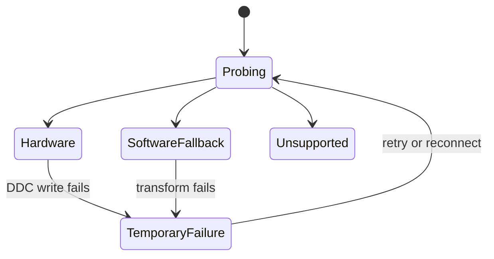

# 04 — Brightness

## Metadata

| Field | Value |
|---|---|
| ID | `04` |
| Classification | Optional standalone |
| Specification status | Ready |
| Implementation status | Not started |
| Dependencies | `01`, `02`, `03` |

## Goal

Add an independent Brightness feature that uses monitor DDC/CI brightness when
reliable and otherwise uses the platform color coordinator for safe software
dimming. The UI exposes one understandable slider per supported display.

## Non-Goals

- No contrast, Night Comfort, volume, keyboard, or resolution behavior.
- No direct gamma-table access outside Specification 03.
- No claim that software dimming changes panel backlight or saves power.
- No sibling feature import or dependency.

## User Experience and States

Each available display shows “Brightness” and a percentage. Hardware control
is unlabeled because it is the preferred normal path. Software fallback adds
“Software dimming”; temporary failure disables the slider with “Try Again”;
unsupported displays omit the control.



## Requirements

- **DORA-04-001:** `BrightnessFeature` is its own SwiftPM module, conforms to
  `DisplayoraFeature`, and registers only brightness controls, settings,
  capability probes, and commands.
- **DORA-04-002:** Hardware brightness uses DDC/CI VCP code `0x10`; support is
  accepted only after a valid capabilities/read probe and a bounded write/read
  verification.
- **DORA-04-003:** Mechanism selection follows Specification 03: reliable
  hardware first, then safe software fallback, then temporary failure or
  unsupported.
- **DORA-04-004:** Software dimming submits a monotonic RGB contribution owned
  by Brightness to `ColorTransformCoordinator`; it never calls display gamma
  APIs directly.
- **DORA-04-005:** Slider input is clamped to `0...100`, updates UI
  immediately, debounces for 75 ms, permits at most ten writes per second, and
  always applies the latest value.
- **DORA-04-006:** HDR or unknown transform safety disables software fallback
  and restores its baseline; DDC hardware remains eligible.
- **DORA-04-007:** Persistent display IDs may store the last user value.
  Connection-scoped IDs are not persisted. Reconnect reprobes before reapplying
  intent.
- **DORA-04-008:** Removing the feature, changing mechanism, disconnecting,
  sleeping, or terminating removes its software contribution. Hardware values
  remain monitor settings and are not silently reset on quit.
- **DORA-04-009:** VoiceOver announces display name, Brightness, percentage,
  fallback state, failure, and retry. No permission is requested.
- **DORA-04-010:** A different Codex reviewer must approve automatic repair
  rounds before implementation becomes `Verified`.

## Interfaces and Data Flow

`BrightnessFeature` depends on Core, UI, Display, and System contracts only.
An actor-isolated `BrightnessController` observes platform snapshots, asks a
`BrightnessHardwareControlling` adapter to read/write VCP `0x10`, or submits a
`ColorTransformContribution` through the shared coordinator.

```text
slider/command -> BrightnessController -> DDC adapter
                                     \-> ColorTransformCoordinator
platform snapshot -> capability state -> registered contribution UI
```

Errors are typed as probe, read, write, verification, stale-display, or
software-transform failures. No public interface mentions Contrast or Night
Comfort.

## Failure and Recovery

A failed write keeps the requested percentage visible but marks it unapplied,
shows “Brightness couldn’t be changed”, and offers one user-triggered retry.
Reconnect, wake, and HDR transitions cancel stale work and reprobe. A failed
software apply follows the coordinator rollback result and never reports
success before commit.

## Accessibility and Permissions

The slider supports keyboard increments of 5% and fine 1% increments, has a
stable accessibility value, and never relies on color alone. Brightness
requests no Accessibility or other TCC permission.

## Platform Considerations

The same source runs on Intel and Apple Silicon macOS 13+. Native tests cover
at least one DDC-capable monitor on each architecture. Unsupported Apple
internal displays are omitted unless the platform supplies an explicitly safe
software mechanism. HDR behavior follows DORA-04-006.

## Standalone and Omission Behavior

```sh
make verify-feature FEATURE=brightness
```

The command builds Brightness alone with Specifications 01–03, runs fake DDC
and transform tests, and composes it in the feature host. When omitted there
is no brightness target dependency, import, slider, setting, command,
shortcut, capability probe, placeholder, or persisted-value access. It never
requires a sibling feature. Run `make check-architecture` to verify this.

## Acceptance Criteria and Traceability

| Criterion | Requirements | Given / When / Then | Verification |
|---|---|---|---|
| `AC-04-01` | `DORA-04-001`, `DORA-04-003` | Given hardware, fallback, failure, and unsupported probes, When Brightness loads, Then exactly the selected reliable state and UI appear. | `TEST-04-01` |
| `AC-04-02` | `DORA-04-002`, `DORA-04-005` | Given rapid slider input, When DDC succeeds or fails, Then writes are bounded, latest-wins, verified, and honestly presented. | `TEST-04-02` |
| `AC-04-03` | `DORA-04-004`, `DORA-04-006`, `DORA-04-008` | Given SDR/HDR, sleep, disconnect, and quit, When software dimming changes state, Then the owned contribution applies or restores without drift. | `TEST-04-03` |
| `AC-04-04` | `DORA-04-007`, `DORA-04-009` | Given persistent and connection-scoped displays, When values restore and VoiceOver navigates, Then only safe identity is persisted and all state is announced. | `TEST-04-04`, `MANUAL-04-04` |
| `AC-04-05` | `DORA-04-010` | Given completed implementation, When independent Codex review automatically repairs findings, Then zero Blocking findings and `Approved` precede `Verified`. | `TEST-04-05` |

## Verification

```sh
make verify-feature FEATURE=brightness
make check-architecture
make verify
make check-review SPEC=04
git diff --check
```

Before `Verified`, review validation reports that a report is not required.
After approval it validates `specs/reviews/04-brightness-review.md`. Manually
exercise DDC, fallback, rapid dragging, HDR, reconnect, sleep/wake, quit, and
VoiceOver on native Intel and Apple Silicon hardware.

## Code Quality and Automatic Review

Implementation follows [CODE_REVIEW.md](CODE_REVIEW.md): idiomatic Swift 6,
small actor-isolated types, typed errors, declarative SwiftUI, `@MainActor` UI,
safe `Sendable` values, no force operations, no warning suppression, and no
sibling coupling. A different Codex reviewer examines the full diff, tests,
interfaces, and results; Codex automatically fixes in-scope Blocking and
scope-preserving quality findings and reruns focused and regression checks.
Tests or acceptance criteria cannot be weakened. Only zero Blocking findings
and `Final verdict: Approved` permit `Verified`.

## Author Self-Review

### Pass 1 — Completeness and User Safety

Added verified DDC writes, latest-wins debounce, honest unapplied state, HDR
fallback removal, and explicit software restoration.

### Pass 2 — Independence and Verifiability

Removed sibling assumptions, separated persistent from connection identity,
and mapped mechanism, lifecycle, accessibility, omission, and review behavior
to tests.

## Pull Request Handoff

Open a dedicated draft PR with a plain-language summary, decisions, human
review focus, stack dependency, and validation results.
