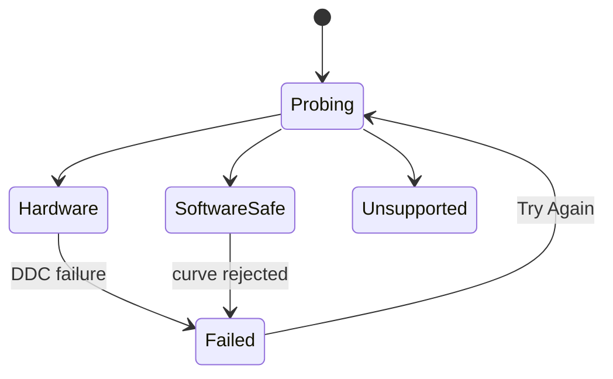

# 05 — Contrast

## Metadata

| Field | Value |
|---|---|
| ID | `05` |
| Classification | Optional standalone |
| Specification status | Ready |
| Implementation status | Not started |
| Dependencies | `01`, `02`, `03` |

## Goal

Provide independent monitor contrast using DDC/CI when reliable and a
clipping-safe software color-curve fallback when the platform declares it
safe.

## Non-Goals

- No brightness, warmth, calibration, ICC-profile editing, or HDR tone mapping.
- No direct color-table writes and no sibling feature dependency.
- No software curve that clips highlights or crushes shadow detail.

## User Experience and States

The display row shows “Contrast” as a percentage. Software mode is explicitly
called “Software contrast”. Temporary failure disables the row with retry;
unsupported displays have no Contrast row.



## Requirements

- **DORA-05-001:** `ContrastFeature` is an optional standalone module
  conforming to `DisplayoraFeature`.
- **DORA-05-002:** Hardware contrast uses probed and verified DDC/CI VCP code
  `0x12`; capability claims alone are insufficient.
- **DORA-05-003:** Reliable hardware wins; otherwise the platform may select
  safe software fallback, temporary failure, or unsupported.
- **DORA-05-004:** Software contrast submits an owned, monotonic 256-sample RGB
  curve around the midpoint through `ColorTransformCoordinator`.
- **DORA-05-005:** The software range is conservatively bounded to
  `75...125%`; curve generation preserves endpoints, finite values, monotonic
  order, and highlight/shadow headroom. Invalid curves never apply.
- **DORA-05-006:** Slider changes use 75 ms debounce, at most ten writes per
  second, and latest-wins cancellation.
- **DORA-05-007:** HDR or unknown transform safety restores and disables the
  software contribution; DDC remains independently eligible.
- **DORA-05-008:** Reconnect and wake reprobe. Removing the last software owner,
  feature omission, sleep, and normal termination restore the platform
  baseline; hardware values remain monitor settings.
- **DORA-05-009:** UI and VoiceOver distinguish hardware, software fallback,
  temporary failure, and unsupported without requesting permission.
- **DORA-05-010:** Independent Codex review and automatic repair must reach
  `Approved` before `Verified`.

## Interfaces and Data Flow

`ContrastController` owns user intent and calls either
`ContrastHardwareControlling` or `ColorTransformCoordinator`. Its contribution
has a stable Contrast owner ID and composes with any other installed color
owner by platform priority and ID, never through a sibling import.

```text
contrast input -> controller -> VCP 0x12
                            \-> validated contrast curve -> shared coordinator
```

## Failure and Recovery

Typed probe, read, write, verification, curve, apply, and stale-endpoint errors
produce an inline message and one retry. Failed software application keeps the
prior composite or restored baseline. Reconnect never reuses an old endpoint.

## Accessibility and Permissions

The slider exposes label, display, percentage, mechanism, and error. Keyboard
steps are 5% and 1% fine adjustment. No Accessibility or TCC permission is
requested.

## Platform Considerations

macOS 13+, Intel, and Apple Silicon use the same behavior. Native manual tests
exercise a DDC-capable monitor and, where safe, SDR software fallback. HDR
software fallback is unavailable unless Specification 03 explicitly permits
it; this specification does not override that decision.

## Standalone and Omission Behavior

```sh
make verify-feature FEATURE=contrast
```

The isolated host contains Contrast plus Specifications 01–03 only. When
omitted, no contrast control, setting, command, probe, transform owner,
placeholder, shortcut, import, or resource remains. `make check-architecture`
rejects sibling coupling.

## Acceptance Criteria and Traceability

| Criterion | Requirements | Given / When / Then | Verification |
|---|---|---|---|
| `AC-05-01` | `DORA-05-001`, `DORA-05-002`, `DORA-05-003` | Given all probe outcomes, When the feature loads, Then one reliable mechanism or no row is selected. | `TEST-05-01` |
| `AC-05-02` | `DORA-05-004`, `DORA-05-005` | Given every allowed percentage, When a curve is generated and composed, Then it is finite, monotonic, bounded, endpoint-preserving, and clipping-safe. | `TEST-05-02` |
| `AC-05-03` | `DORA-05-006`, `DORA-05-007`, `DORA-05-008` | Given rapid input, HDR, reconnect, sleep, and quit, When state changes, Then latest intent applies safely and software state restores. | `TEST-05-03`, `MANUAL-05-03` |
| `AC-05-04` | `DORA-05-009` | Given keyboard and VoiceOver, When every state is visited, Then the control is operable and semantically announced without permission. | `TEST-05-04`, `MANUAL-05-04` |
| `AC-05-05` | `DORA-05-010` | Given implementation results, When a different Codex reviewer requests changes, Then Codex automatically repairs them until zero Blocking findings and `Approved`. | `TEST-05-05` |

## Verification

```sh
make verify-feature FEATURE=contrast
make check-architecture
make verify
make check-review SPEC=05
git diff --check
```

Manually verify DDC, SDR fallback, clipping patterns, HDR, reconnect, sleep,
quit, keyboard, and VoiceOver on native Intel and Apple Silicon. The approved
report is `specs/reviews/05-contrast-review.md`.

## Code Quality and Automatic Review

Apply [CODE_REVIEW.md](CODE_REVIEW.md): straightforward Swift 6, typed errors,
focused actors/value types, declarative SwiftUI, safe concurrency, no direct
gamma access, no sibling coupling, no force operations, and warning-free
checks. A different Codex reviewer reviews the complete diff and tests. Codex
automatically repairs all in-scope findings and reruns focused and regression
validation without weakening tests. `Approved` with zero Blocking findings is
required for `Verified`.

## Author Self-Review

### Pass 1 — Completeness and User Safety

Bounded software range, headroom validation, transactional failure, HDR
restoration, and stale-endpoint handling were made explicit.

### Pass 2 — Independence and Verifiability

Removed Brightness/Night Comfort assumptions and added standalone, omission,
curve-property, native hardware, accessibility, and review evidence.

## Pull Request Handoff

Open a dedicated draft PR using the human-readable summary template.
