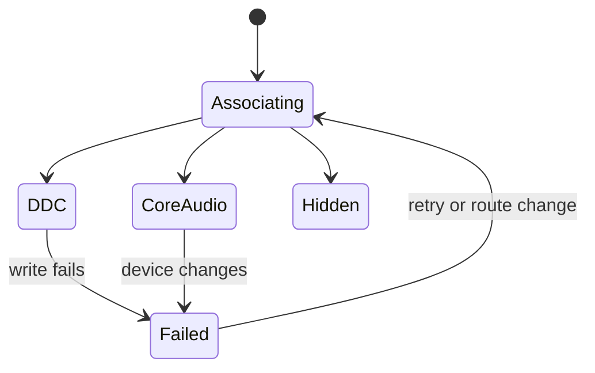

# 06 — Volume and Mute

## Metadata

| Field | Value |
|---|---|
| ID | `06` |
| Classification | Optional standalone |
| Specification status | Ready |
| Implementation status | Not started |
| Dependencies | `01`, `02`, `03` |

## Goal

Control display audio only when Displayora can reliably address either the
monitor’s DDC audio controls or one confidently associated writable Core Audio
output. Hide unreliable controls rather than changing the wrong device.

## Non-Goals

- No system-wide default-output chooser, audio routing, balance, EQ, or input.
- No guessed association based only on similar names.
- No sibling feature dependency or permission request.

## User Experience and States

A supported display shows “Volume” and, when independently supported, “Mute”.
The UI does not expose DDC or Core Audio terminology. If neither mechanism is
reliable the complete feature row is omitted.



## Requirements

- **DORA-06-001:** `VolumeFeature` is an optional standalone
  `DisplayoraFeature` module with the exact static `FeatureID`
  `volume-and-mute`. It registers `volume-and-mute.increase-all`,
  `volume-and-mute.decrease-all`, and `volume-and-mute.toggle-mute-all`.
  Increment commands change every currently active, confidently associated
  supported output by five percentage points. Toggle mutes all targets unless
  all are already muted, in which case it unmutes all; no eligible target is a
  typed unavailable result.
- **DORA-06-002:** DDC volume uses continuous VCP `0x62` and requires a valid
  nonzero reported maximum. DDC mute uses VCP `0x8D` only when probing proves
  the simple MCCS values `0x01` (mute) and `0x02` (unmute) are readable and
  writable; unknown or complex vendor values are unsupported rather than
  guessed. Both controls require bounded no-op write/read verification of the
  current value.
- **DORA-06-003:** Core Audio is eligible only for a writable output with a
  stable device UID and a one-to-one association supplied by an injected
  `DisplayAudioAssociating` adapter using transport/route identity. Names alone
  never establish confidence.
- **DORA-06-004:** DDC is preferred when reliable. Otherwise a confidently
  associated Core Audio device is used. Ambiguity, multiple candidates,
  read-only properties, or no mechanism hides the feature.
- **DORA-06-005:** Volume is `0...100`, debounced 75 ms, latest-wins, and
  verified. DDC volume displays `round(rawCurrent / rawMaximum * 100)`, writes
  `round(percent / 100 * rawMaximum)`, and accepts read-back only within one
  normalized percentage point. Mute is shown only when the selected mechanism
  has independently verified writable mute.
- **DORA-06-006:** Changing the default route does not redirect a display row
  unless association is recomputed and remains one-to-one. Stale AudioObject
  IDs and display endpoints are rejected.
- **DORA-06-007:** Device add/remove, route change, hot-plug, sleep/wake, and
  explicit retry cancel operations and reassociate without polling.
- **DORA-06-008:** Failures preserve the last confirmed value, mark requested
  values unapplied, and never fall through to a lower-confidence device.
- **DORA-06-009:** VoiceOver exposes display, volume, mute state, and failure;
  the feature requests no Microphone or Accessibility permission.
- **DORA-06-010:** Independent Codex review and automatic repair are required
  before `Verified`.

## Interfaces and Data Flow

`VolumeController` observes display and audio snapshots. It chooses one typed
`DisplayAudioMechanism` and sends commands through
`MonitorAudioControlling` or `CoreAudioOutputControlling`.

```text
display + audio routes -> confidence association -> selected mechanism
volume/mute action -> controller -> DDC or associated Core Audio output
```

Adapters and fakes are `Sendable`; UI state is `@MainActor`. No interface
imports or refers to a sibling feature.

## Failure and Recovery

Typed association, unsupported, read-only, read, write, verification, stale,
and disconnected errors are recoverable. A route change immediately disables
the row until association completes. Retry performs one association/probe
cycle. The feature makes no state change that requires termination restoration.

## Accessibility and Permissions

The slider and mute toggle have complete labels, values, keyboard operation,
and textual failure. No Microphone access is needed to control output volume;
no TCC prompt or usage-description key is added.

## Platform Considerations

The same macOS 13+ logic applies on Intel and Apple Silicon. Native tests
cover DDC audio when available and an external-display Core Audio route.
Hardware absence is a supported omission outcome.

## Standalone and Omission Behavior

```sh
make verify-feature FEATURE=volume-and-mute
```

The host selects Volume only with platform fakes. When omitted—or when runtime
association is unreliable—there is no row, setting, command, shortcut,
placeholder, probe, or broken import. The module depends on no sibling.
`make check-architecture` verifies target isolation.

## Acceptance Criteria and Traceability

| Criterion | Requirements | Given / When / Then | Verification |
|---|---|---|---|
| `AC-06-01` | `DORA-06-001`, `DORA-06-002`, `DORA-06-004` | Given reliable DDC, When the feature loads, Then verified monitor volume is selected and available mute is presented independently. | `TEST-06-01` |
| `AC-06-02` | `DORA-06-003`, `DORA-06-004`, `DORA-06-006` | Given unique, ambiguous, read-only, and changing routes, When association runs, Then only a stable one-to-one writable output is controlled. | `TEST-06-02` |
| `AC-06-03` | `DORA-06-005`, `DORA-06-007`, `DORA-06-008` | Given rapid input and lifecycle changes, When operations race, Then latest confirmed state wins and no stale/wrong device changes. | `TEST-06-03`, `MANUAL-06-03` |
| `AC-06-04` | `DORA-06-009` | Given VoiceOver and no supported mechanism, When UI is inspected, Then supported controls are labeled and unreliable UI is completely absent without permission. | `TEST-06-04`, `MANUAL-06-04` |
| `AC-06-05` | `DORA-06-010` | Given implementation, When independent Codex review runs, Then automatic repair reaches zero Blocking findings and `Approved` before `Verified`. | `TEST-06-05` |

## Verification

```sh
make verify-feature FEATURE=volume-and-mute
make check-architecture
make verify
make check-review SPEC=06
git diff --check
```

Manually test DDC, unique Core Audio association, ambiguous routes, unplug,
route changes, sleep/wake, keyboard, and VoiceOver on native Intel and Apple
Silicon. Approved evidence lives in
`specs/reviews/06-volume-and-mute-review.md`.

## Code Quality and Automatic Review

Follow [CODE_REVIEW.md](CODE_REVIEW.md): idiomatic Swift 6, focused adapters,
typed errors, actor-safe state, declarative SwiftUI, no guessed association,
silent fallback, force operation, or sibling coupling. A different Codex
reviewer examines the full diff and tests; Codex automatically repairs
in-scope findings and reruns validation without weakening tests. Zero Blocking
findings and `Approved` are mandatory for `Verified`.

## Author Self-Review

### Pass 1 — Completeness and User Safety

Replaced name matching with one-to-one association, separated mute support,
and specified stale-route cancellation and honest unapplied state.

### Pass 2 — Independence and Verifiability

Added hidden-state, route-change, permission, omission, native hardware, and
independent review coverage without relying on any sibling feature.

## Pull Request Handoff

Open a dedicated draft PR with the plain-language review template.
