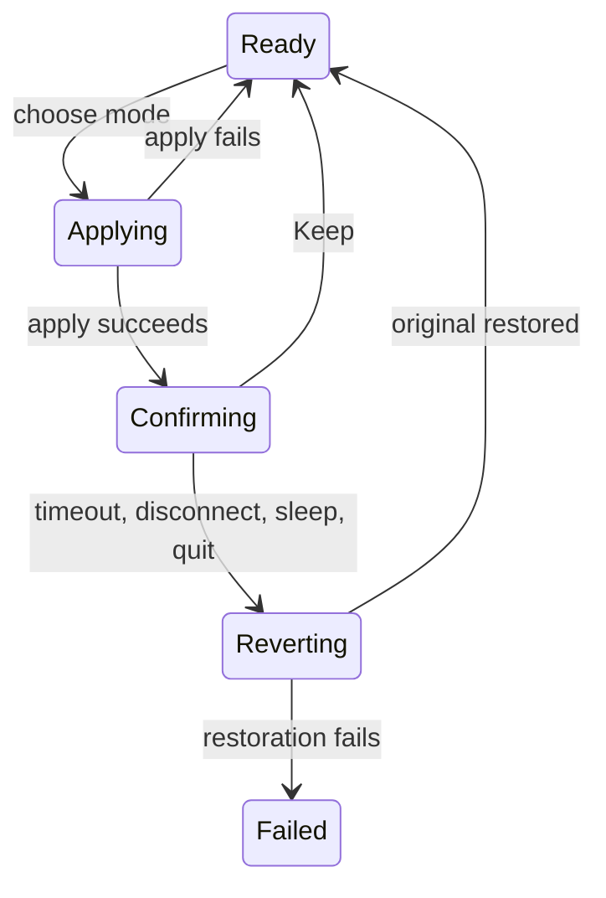

# 07 — Resolution Selector

## Metadata

| Field | Value |
|---|---|
| ID | `07` |
| Classification | Optional standalone |
| Specification status | Ready |
| Implementation status | Not started |
| Dependencies | `01`, `02`, `03` |

## Goal

Let users select an available display mode with clear HiDPI, logical size,
pixel size, and refresh-rate information, protected by a fifteen-second
confirmation and automatic revert.

## Non-Goals

- No custom mode creation, rotation, arrangement, mirroring, or display disable.
- No private APIs and no sibling feature dependency.
- No permanent application of an unconfirmed or stale mode.

## User Experience and States

The current mode is marked “Current”. Choices read, for example,
“2560 × 1440 (looks like 1280 × 720), HiDPI, 60 Hz”. After a change, a
prominent confirmation asks “Keep this display mode?” with “Keep” and
“Revert”; it counts down from 15 seconds.



## Requirements

- **DORA-07-001:** `ResolutionFeature` is an optional standalone
  `DisplayoraFeature` module using public Core Graphics APIs.
- **DORA-07-002:** Modes come from `CGDisplayCopyAllDisplayModes`, are filtered
  to usable non-duplicate modes, and are keyed by complete mode identity rather
  than display text.
- **DORA-07-003:** Each label reports pixel width/height, logical
  width/height when different, HiDPI state, refresh rate (or “Variable”), and
  current state. Sorting is logical area, scale, refresh, then stable key.
- **DORA-07-004:** Applying uses a generation-safe endpoint and a typed
  `DisplayModeApplying` adapter. Unsupported or stale modes cannot be invoked.
- **DORA-07-005:** Before apply, capture the exact original mode. On success
  start a monotonic 15-second confirmation. “Keep” commits; timeout reverts.
- **DORA-07-006:** Only one confirmation may exist. A second display change is
  disabled until the first resolves.
- **DORA-07-007:** Disconnect, sleep, app termination, or feature removal
  during confirmation triggers immediate best-effort revert before teardown.
- **DORA-07-008:** Failed apply leaves the current mode unchanged. Failed
  revert shows a persistent safety error, refreshes actual modes, and never
  claims the original was restored.
- **DORA-07-009:** Confirmation is keyboard/VoiceOver accessible, does not rely
  on animation or color, and requests no permission.
- **DORA-07-010:** Native Intel and Apple Silicon evidence plus independent
  Codex automatic review are required before `Verified`.

## Interfaces and Data Flow

`ResolutionController` owns immutable `DisplayModeOption` values and delegates
enumeration/application to a System adapter. A clock and lifecycle source are
injected for deterministic tests.

```text
platform endpoint -> mode enumeration -> sorted options -> menu
selection -> capture original -> apply -> 15 s confirmation -> keep/revert
```

No optional sibling is imported or consulted.

## Failure and Recovery

Typed enumeration, stale-mode, apply, timer, disconnect, and revert failures
drive explicit UI. Confirmation survives popover closure in app-model state.
Reopening shows the remaining monotonic duration. Relaunch does not assume a
pending mode can be restored; normal termination attempts revert synchronously
within a bounded shutdown window.

## Accessibility and Permissions

Mode labels are complete spoken phrases. Focus enters the confirmation at
“Keep”, then “Revert”; the countdown is announced at 10 and 5 seconds, not
every second. No Accessibility or other TCC permission is requested.

## Platform Considerations

Use public Core Graphics on macOS 13+ with identical Intel/Apple Silicon
behavior. HDR modes are not inferred from resolution. Native manual checks
include an external display and the same universal app on both architectures.

## Standalone and Omission Behavior

```sh
make verify-feature FEATURE=resolution-selector
```

The isolated host uses fake modes and a virtual clock. When omitted there is
no mode menu, current-mode text, confirmation, command, setting, shortcut,
adapter call, import, or placeholder. `make check-architecture` confirms no
sibling dependency.

## Acceptance Criteria and Traceability

| Criterion | Requirements | Given / When / Then | Verification |
|---|---|---|---|
| `AC-07-01` | `DORA-07-001`, `DORA-07-002`, `DORA-07-003` | Given duplicate, HiDPI, variable, and current modes, When options render, Then they are uniquely keyed, sorted, and clearly labeled. | `TEST-07-01` |
| `AC-07-02` | `DORA-07-004`, `DORA-07-005`, `DORA-07-006` | Given a valid selection, When it applies, Then one 15-second confirmation controls commit or exact revert. | `TEST-07-02` |
| `AC-07-03` | `DORA-07-007`, `DORA-07-008` | Given timeout, sleep, disconnect, quit, and revert failure, When confirmation is unresolved, Then restoration is attempted and actual state is reported honestly. | `TEST-07-03`, `MANUAL-07-03` |
| `AC-07-04` | `DORA-07-009` | Given keyboard and VoiceOver, When confirmation counts down, Then actions and essential timing remain operable and concise without permission. | `TEST-07-04`, `MANUAL-07-04` |
| `AC-07-05` | `DORA-07-010` | Given completed checks, When a different Codex reviewer runs automatic repair rounds, Then zero Blocking findings and `Approved` precede `Verified`. | `TEST-07-05` |

## Verification

```sh
make verify-feature FEATURE=resolution-selector
make check-architecture
make verify
make check-review SPEC=07
git diff --check
```

Manually verify labels, Keep, timeout revert, popover closure, disconnect,
sleep, quit, failure, keyboard, and VoiceOver on native Intel and Apple
Silicon. Review evidence:
`specs/reviews/07-resolution-selector-review.md`.

## Code Quality and Automatic Review

Follow [CODE_REVIEW.md](CODE_REVIEW.md): small Swift 6 types, typed errors,
monotonic injected time, actor-safe state, declarative SwiftUI, public APIs,
and no force operation, hidden failure, warning suppression, or sibling
coupling. A different Codex reviewer inspects full changes and tests; Codex
automatically fixes in-scope findings and reruns checks. Tests cannot be
weakened. Zero Blocking findings and `Approved` are required for `Verified`.

## Author Self-Review

### Pass 1 — Completeness and User Safety

Added exact original-mode capture, single pending change, lifecycle reverts,
bounded shutdown, persistent failure, and honest actual-state refresh.

### Pass 2 — Independence and Verifiability

Clarified mode labels and keys, injected clock tests, omission, native
architecture checks, accessibility announcements, and automatic review.

## Pull Request Handoff

Open a dedicated draft PR with a plain-language summary and safety focus.
