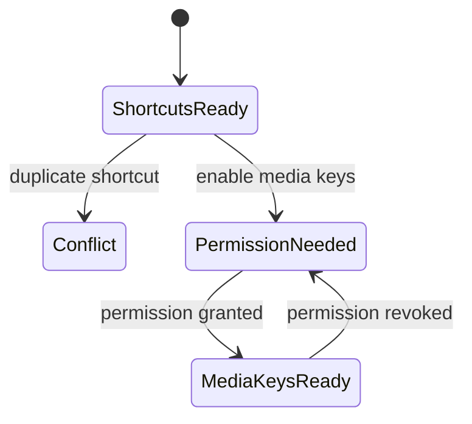

# 08 — Keyboard Controls

## Metadata

| Field | Value |
|---|---|
| ID | `08` |
| Classification | Optional standalone |
| Specification status | Ready |
| Implementation status | Not started |
| Dependencies | `01`, `02`, `03` |

## Goal

Provide keyboard access to commands registered by installed features.
Configurable shortcuts work without Accessibility permission. Optional native
media-key interception is enabled only after clear Accessibility onboarding.

## Non-Goals

- No display, brightness, volume, or other feature logic.
- No command for an omitted feature and no sibling feature import.
- No key logging, typed-character storage, or automatic permission prompt.

## User Experience and States

Settings lists only available commands. Users can record, clear, and test a
shortcut. Conflicts are explained before saving. “Use display media keys” is
off by default and explains why Accessibility is needed before opening System
Settings.



## Requirements

- **DORA-08-001:** `KeyboardControlsFeature` is an optional standalone
  `DisplayoraFeature` that reads commands only from `FeatureRegistry`.
- **DORA-08-002:** Only installed, enabled commands are shown or routable.
  Registry changes remove stale shortcuts and media-key mappings immediately.
- **DORA-08-003:** Configurable global shortcuts use a public macOS hot-key
  registration adapter that does not require Accessibility permission.
- **DORA-08-004:** Recording rejects reserved system combinations, duplicates,
  modifier-only input, and conflicts; it never captures ordinary typing after
  recording ends.
- **DORA-08-005:** Native brightness/volume media keys are optional, off by
  default, and use an isolated event-tap adapter only when Accessibility is
  trusted.
- **DORA-08-006:** Permission onboarding explains the purpose before the user
  chooses “Open Accessibility Settings”. Denial or revocation disables only
  native media keys; configurable shortcuts continue working.
- **DORA-08-007:** Commands are async, main-actor routed, non-reentrant per
  command, and surface typed unavailable/failure feedback.
- **DORA-08-008:** Shortcut persistence uses stable command IDs; entries for
  omitted commands are ignored and removed on the next successful save.
- **DORA-08-009:** Settings, recording, conflicts, permission state, and
  command failures are fully keyboard and VoiceOver accessible.
- **DORA-08-010:** Independent Codex review and automatic repair must be
  `Approved` before `Verified`.

## Interfaces and Data Flow

`CommandRouter` consumes the platform command snapshot.
`GlobalShortcutRegistering` and `MediaKeyMonitoring` isolate system APIs.

```text
FeatureRegistry commands -> Keyboard Controls settings -> shortcut map
hot key / allowed media key -> CommandRouter -> registered command action
```

The module never imports a sibling feature or guesses a command.

## Failure and Recovery

Registration conflicts leave the previous shortcut active. Permission loss
stops and releases the media-key monitor immediately. A command unavailable
for current display state gives one concise notification and does not retry
automatically.

## Accessibility and Permissions

Configurable shortcuts require no TCC permission. Native media keys use
Accessibility only after explicit opt-in. VoiceOver announces the recorded
combination, conflicts, permission state, and test result.

## Platform Considerations

Use macOS 13+ public shortcut APIs and an isolated, availability-checked event
tap. Intel and Apple Silicon behavior is identical. Secure input or event-tap
disablement produces a recoverable unavailable state.

## Standalone and Omission Behavior

```sh
make verify-feature FEATURE=keyboard-controls
```

The isolated host uses fixture commands from platform contracts. When omitted
there is no shortcut setting, event tap, permission text, media-key monitor,
command mapping, placeholder, or import. Commands from omitted sibling
features never appear. Run `make check-architecture` for isolation.

## Acceptance Criteria and Traceability

| Criterion | Requirements | Given / When / Then | Verification |
|---|---|---|---|
| `AC-08-01` | `DORA-08-001`, `DORA-08-002`, `DORA-08-008` | Given changing installed commands, When settings load, Then only current commands and mappings exist. | `TEST-08-01` |
| `AC-08-02` | `DORA-08-003`, `DORA-08-004` | Given valid, reserved, and conflicting input, When recording ends, Then only a valid no-permission hot key is saved. | `TEST-08-02` |
| `AC-08-03` | `DORA-08-005`, `DORA-08-006` | Given permission denied, granted, and revoked, When media keys are enabled, Then interception follows trust while configurable shortcuts remain active. | `TEST-08-03`, `MANUAL-08-03` |
| `AC-08-04` | `DORA-08-007`, `DORA-08-009` | Given repeated input and command failure, When routing occurs, Then execution is non-reentrant, recoverable, and accessible. | `TEST-08-04`, `MANUAL-08-04` |
| `AC-08-05` | `DORA-08-010` | Given implementation, When independent Codex review automatically repairs findings, Then zero Blocking findings and `Approved` precede `Verified`. | `TEST-08-05` |

## Verification

```sh
make verify-feature FEATURE=keyboard-controls
make check-architecture
make verify
make check-review SPEC=08
git diff --check
```

### Verification evidence

| ID | Required evidence |
|---|---|
| `TEST-08-01` | command-registry snapshot and persistence tests covering installation, disablement, omission, removal, and successful-save cleanup |
| `TEST-08-02` | shortcut recording/registration tests for valid, reserved, duplicate, modifier-only, conflicting, and post-recording input |
| `TEST-08-03` | permission-state adapter tests proving denial/revocation affects only media keys and always releases the event tap |
| `MANUAL-08-03` | On native Intel and Apple Silicon, record configurable shortcuts without permission, explicit opt-in, denial, grant, revocation, secure-input/event-tap disablement, and process architecture. |
| `TEST-08-04` | command-router non-reentrancy, typed failure, stale command, keyboard, and accessibility-semantic tests |
| `MANUAL-08-04` | VoiceOver and Full Keyboard Access pass/fail for recording, conflicts, permission explanation, test command, and failure feedback |
| `TEST-08-05` | `make check-review SPEC=08` against the final approved review report |

Manual verification covers configurable shortcuts without permission,
permission denial/grant/revocation, media keys, conflicts, omitted commands,
VoiceOver, and native Intel/Apple Silicon. Review report:
`specs/reviews/08-keyboard-controls-review.md`.

## Code Quality and Automatic Review

Follow [CODE_REVIEW.md](CODE_REVIEW.md): idiomatic Swift 6, focused adapters,
typed errors, safe actor boundaries, declarative SwiftUI, minimal event
capture, and no sibling coupling. A different Codex reviewer examines the
complete diff and tests; Codex automatically repairs in-scope findings and
reruns checks without weakening tests. Zero Blocking findings and `Approved`
are required for `Verified`.

## Author Self-Review

### Pass 1 — Completeness and User Safety

Separated permission-free shortcuts from media keys and added conflict,
revocation, non-reentrancy, secure-input, and stale-command behavior.

### Pass 2 — Independence and Verifiability

Made the registry the only command source and added omission, accessibility,
permission, native architecture, and review evidence.

## Pull Request Handoff

Open a dedicated draft PR with a plain-language permission and routing summary.
