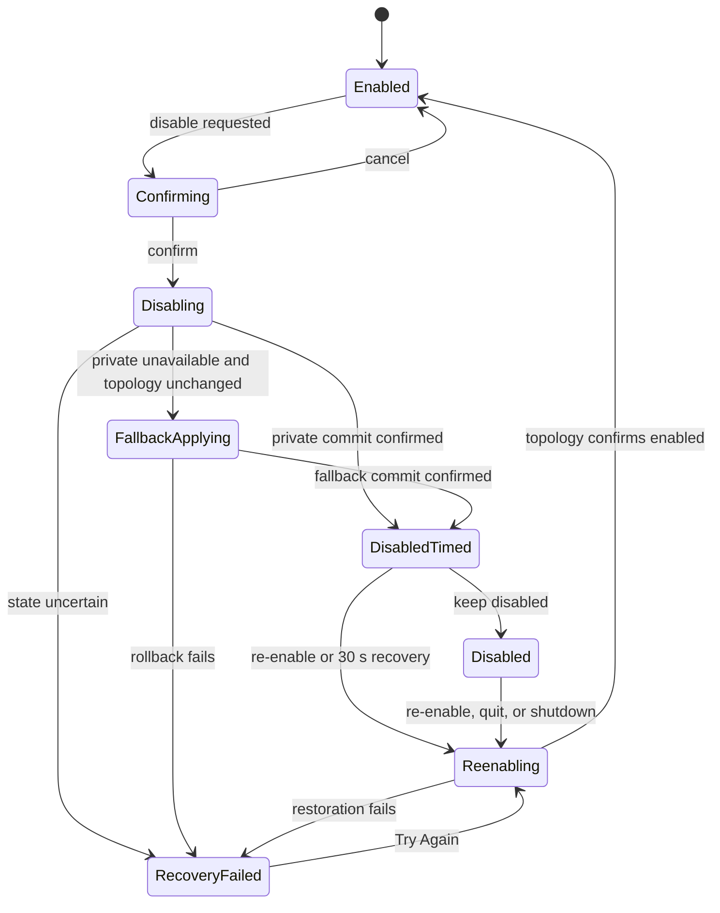

# 09 — Disable and Re-enable Display

## Metadata

| Field | Value |
|---|---|
| ID | `09` |
| Classification | Optional standalone |
| Specification status | Ready |
| Implementation status | Not started |
| Dependencies | `01`, `02`, `03` |

## Goal

Temporarily disable and safely re-enable a selected display while preventing
the user from losing every usable screen. Prefer an isolated
`CGSConfigureDisplayEnabled` adapter when runtime checks pass and otherwise use
a reversible mirror-plus-gamma fallback.

## Non-Goals

- No permanent display removal, sleep control, arrangement editor, or remote
  administration.
- No direct private API use outside the isolated adapter.
- No sibling feature dependency.

## User Experience and States

The action reads “Temporarily disable this display”. A confirmation explains
that the display will return automatically after 30 seconds unless the user
chooses “Keep Disabled”. Re-enable is always visible from another active
display and Settings.



## Requirements

- **DORA-09-001:** `DisplayStateFeature` is an optional standalone module.
- **DORA-09-002:** The LightsOut-inspired private call
  `CGSConfigureDisplayEnabled` exists only inside
  `PrivateDisplayEnableAdapter`; symbols are resolved at runtime, signatures
  are documented, and unavailability returns typed unsupported.
- **DORA-09-003:** Private configuration always uses `.forAppOnly`; no global
  or persistent configuration is requested.
- **DORA-09-004:** Disable is rejected if it would leave no other active,
  non-mirrored, usable display. The check repeats immediately before commit.
- **DORA-09-005:** A successful disable starts a monotonic 30-second recovery
  timer. Re-enable is idempotent and available from UI and command registry.
- **DORA-09-006:** “Keep Disabled” cancels only the timer; normal termination,
  feature removal, and platform shutdown still re-enable all displays owned by
  the feature.
- **DORA-09-007:** Sleep/wake, topology change, stale endpoint, or loss of the
  recovery display immediately attempts restoration and reconciles actual
  topology.
- **DORA-09-008:** If the private adapter is unavailable, an isolated fallback
  may mirror the target to a safe active display and apply an owned
  zero-luminance gamma contribution. After any private-adapter error, fallback
  is permitted only when a fresh topology snapshot proves that the private
  path made no change. Unknown or partial private state enters recovery instead
  of attempting fallback. Both fallback parts commit transactionally and are
  restored together in reverse order.
- **DORA-09-009:** Failure never claims a display is disabled or restored until
  a fresh topology snapshot confirms it. An uncertain or failed recovery
  disables further disable actions, retains an idempotent “Try Again” recovery
  action, and keeps manual recovery guidance visible until every
  feature-owned display is confirmed enabled.
- **DORA-09-010:** Confirmation, countdown, recovery, and errors are keyboard
  and VoiceOver accessible and require no TCC permission.
- **DORA-09-011:** Native Intel and Apple Silicon tests are mandatory because
  private behavior may differ.
- **DORA-09-012:** Independent Codex review automatically repairs findings and
  must record `Approved` before `Verified`.

## Interfaces and Data Flow

`DisplayStateController` owns a set of disabled `DisplayID` values and uses
`DisplayEnableControlling`, `DisplayMirroring`, the shared color coordinator,
an injected monotonic clock, and platform topology snapshots.

```text
request -> final-display guard -> private adapter transaction
                              \-> mirror + gamma fallback transaction
topology/timer/quit -> idempotent restoration -> confirmed enabled snapshot
```

No private symbol, raw display ID, or sibling feature is exposed outside the
System adapter boundary.

## Failure and Recovery

Every step records whether it committed. A private-adapter error first
reconciles topology: fallback starts only after the target is confirmed
unchanged; otherwise the controller enters recovery. Partial fallback rolls
back in reverse order. Restoration retries once after a fresh topology
snapshot; continued failure blocks new disable requests, preserves the
idempotent recovery action, shows manual recovery guidance, and logs
privacy-safe evidence. Forced termination cannot guarantee recovery and is
explicitly documented; the 30-second timer and normal-termination hook reduce
that risk.

## Accessibility and Permissions

Destructive wording is explicit, focus begins on Cancel, the countdown is
textual, and re-enable has a stable keyboard path. No Accessibility or other
permission is requested.

## Platform Considerations

Runtime symbol and behavior checks run independently on macOS 13+ Intel and
Apple Silicon. Absence or changed behavior disables the private path without a
crash. Native verification—not Rosetta alone—is required.

## Standalone and Omission Behavior

```sh
make verify-feature FEATURE=disable-and-reenable-display
```

The isolated host uses fake topology, private adapter, mirror adapter, clock,
and gamma coordinator. When omitted there is no disable/re-enable action,
private symbol lookup, fallback, timer, command, setting, placeholder, or
import. No sibling is required. Run `make check-architecture`.

## Acceptance Criteria and Traceability

| Criterion | Requirements | Given / When / Then | Verification |
|---|---|---|---|
| `AC-09-01` | `DORA-09-001`, `DORA-09-002`, `DORA-09-003` | Given available and missing symbols, When disable is requested, Then private use is isolated, runtime checked, and `.forAppOnly`. | `TEST-09-01` |
| `AC-09-02` | `DORA-09-004`, `DORA-09-005`, `DORA-09-006` | Given one or multiple usable displays, When disable/keep/timer/quit occur, Then the final display is protected and owned state restores. | `TEST-09-02`, `MANUAL-09-02` |
| `AC-09-03` | `DORA-09-007`, `DORA-09-008`, `DORA-09-009` | Given lifecycle changes, private-path uncertainty, and partial fallback failures, When reconciliation and recovery run, Then fallback starts only from confirmed unchanged topology, rollback is ordered, and UI reports only confirmed state. | `TEST-09-03`, `MANUAL-09-03` |
| `AC-09-04` | `DORA-09-010`, `DORA-09-011` | Given native Intel/Apple Silicon and assistive technology, When all states are exercised, Then behavior is recoverable and accessible without permission. | `MANUAL-09-04` |
| `AC-09-05` | `DORA-09-012` | Given implementation evidence, When a different Codex reviewer runs automatic repair, Then zero Blocking findings and `Approved` precede `Verified`. | `TEST-09-05` |

## Verification

```sh
make verify-feature FEATURE=disable-and-reenable-display
make check-architecture
make verify
make check-review SPEC=09
git diff --check
```

Manually verify final-display protection, timed recovery, keep/re-enable,
sleep, unplug, quit, private-path absence, fallback rollback, keyboard, and
VoiceOver on native Intel and Apple Silicon. Review report:
`specs/reviews/09-disable-and-reenable-display-review.md`.

## Code Quality and Automatic Review

Apply [CODE_REVIEW.md](CODE_REVIEW.md) with special scrutiny of private API
isolation, transactional rollback, idempotent restoration, typed errors,
actor safety, and readable Swift 6. No force operations, hidden failures,
warning suppression, or sibling coupling. A different Codex reviewer reviews
the complete diff and tests; Codex automatically fixes in-scope findings and
reruns all checks. Zero Blocking findings and `Approved` are required for
`Verified`.

## Author Self-Review

### Pass 1 — Completeness and User Safety

Added repeated final-display checks, timed and termination recovery, partial
fallback rollback, topology confirmation, and explicit forced-quit limits.

### Pass 2 — Independence and Verifiability

Isolated the private API, removed sibling assumptions, and added fake,
omission, accessibility, native architecture, and review coverage.

## Pull Request Handoff

Open a dedicated draft PR highlighting private API and recovery decisions.
