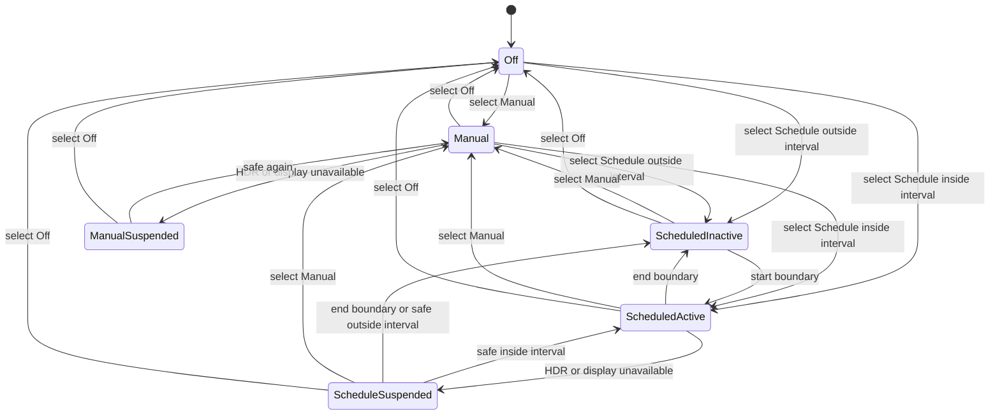

# 10 — Night Comfort

## Metadata

| Field | Value |
|---|---|
| ID | `10` |
| Classification | Optional standalone |
| Specification status | Ready |
| Implementation status | Not started |
| Dependencies | `01`, `02`, `03` |

## Goal

Provide manual display warmth and a fixed daily schedule without Location
permission. Night Comfort works when Brightness and Contrast are absent by
using only the shared platform color-transform coordinator.

## Non-Goals

- No sunrise/sunset, geolocation, ambient-light sensing, or cloud sync.
- No brightness or contrast adjustment and no sibling feature dependency.
- No software transform when the platform says HDR safety is unknown.

## User Experience and States

Users choose Off, Manual, or Schedule. Manual exposes “Warmer” from 0–100%.
Schedule has start and end local times and supports overnight ranges such as
21:00–07:00. Status says “On until 07:00” or “Starts at 21:00”.



## Requirements

- **DORA-10-001:** `NightComfortFeature` is an optional standalone
  `DisplayoraFeature`.
- **DORA-10-002:** Manual warmth is `0...100%` and maps to a finite, monotonic,
  endpoint-safe RGB contribution owned by Night Comfort.
- **DORA-10-003:** Fixed schedules store local start/end minutes and enabled
  state. Equal start/end means inactive all day, not always on.
- **DORA-10-004:** Overnight evaluation is explicit: active when local time is
  at or after start or before end. Non-overnight is active from start through
  before end.
- **DORA-10-005:** The scheduler uses injected clock/calendar/timezone values,
  computes the next boundary, and reschedules after timezone, daylight-saving,
  clock, locale, sleep, and wake changes.
- **DORA-10-006:** The feature submits/removes only its own
  `ColorTransformCoordinator` contribution and never imports Brightness,
  Contrast, or another sibling.
- **DORA-10-007:** HDR, unknown transform safety, or display unavailability
  removes the contribution. The UI reports the actual cause: “Night Comfort is
  paused for HDR”, “Night Comfort is paused while display safety is unknown”,
  or “Night Comfort is paused while the display is unavailable”. When a safe
  display returns, the controller reevaluates the selected mode, current local
  time, and schedule before submitting a new contribution; it never reuses a
  stale contribution.
- **DORA-10-008:** Disconnect, sleep, feature removal, mode Off, and normal
  termination restore the owned transform. Wake and reconnect reevaluate.
- **DORA-10-009:** Settings and status are keyboard/VoiceOver accessible,
  textual, and request no Location, Accessibility, or other permission.
- **DORA-10-010:** Independent Codex review and automatic repair must reach
  `Approved` before `Verified`.

## Interfaces and Data Flow

`NightComfortController` owns mode and schedule. `NightComfortScheduling`
provides the next boundary using injected time. The controller submits one
owner contribution to the platform coordinator.

```text
manual/schedule settings -> controller -> warmth curve -> color coordinator
clock/timezone/lifecycle -> reevaluate intent -> apply/remove own contribution
```

No optional sibling type or state participates.

## Failure and Recovery

Invalid stored settings fall back to Off with a visible reset message. Apply
failure keeps intent but shows “Night Comfort couldn’t be applied” rather than
an HDR or availability pause reason. Time changes cancel the old timer before
scheduling one new boundary. Leaving a suspended state always reevaluates mode,
current local time, schedule boundaries, and display safety. Repeated events
are idempotent.

## Accessibility and Permissions

Time fields use locale-aware controls with explicit start/end labels.
VoiceOver announces current mode, warmth, schedule, pause reason, and next
boundary. The feature never requests Location because schedules are fixed
local times.

## Platform Considerations

macOS 13+ Intel systems share the same calendar logic. Tests cover
spring-forward, fall-back, timezone changes, overnight ranges, sleep/wake, and
HDR. The current system timezone is authoritative.

## Standalone and Omission Behavior

```sh
make verify-feature FEATURE=night-comfort
```

The isolated host includes only Night Comfort and Specifications 01–03 with a
fake clock/coordinator. When omitted there is no warmth control, schedule,
timer, setting, command, transform owner, permission text, placeholder, or
import. `make check-architecture` rejects sibling coupling.

## Acceptance Criteria and Traceability

| Criterion | Requirements | Given / When / Then | Verification |
|---|---|---|---|
| `AC-10-01` | `DORA-10-001`, `DORA-10-002`, `DORA-10-006` | Given Night Comfort alone, When manual warmth changes, Then only its valid owned curve changes and no sibling is required. | `TEST-10-01` |
| `AC-10-02` | `DORA-10-003`, `DORA-10-004`, `DORA-10-005` | Given daytime, overnight, equal, DST, timezone, and clock cases, When boundaries pass, Then active state and next timer are correct. | `TEST-10-02` |
| `AC-10-03` | `DORA-10-007`, `DORA-10-008` | Given Manual or Schedule mode, HDR, unknown safety, sleep, disconnect, wake, Off, and quit, When safety changes, Then the owned transform restores, the exact pause reason appears, and recovery reevaluates mode and the current schedule before applying. | `TEST-10-03`, `MANUAL-10-03` |
| `AC-10-04` | `DORA-10-009` | Given keyboard and VoiceOver, When settings and paused states are used, Then all meaning is operable and announced without permission. | `TEST-10-04`, `MANUAL-10-04` |
| `AC-10-05` | `DORA-10-010` | Given implementation, When independent Codex review automatically repairs findings, Then zero Blocking findings and `Approved` precede `Verified`. | `TEST-10-05` |

## Verification

```sh
make verify-feature FEATURE=night-comfort
make check-architecture
make verify
make check-review SPEC=10
git diff --check
```

### Verification evidence

| ID | Required evidence |
|---|---|
| `TEST-10-01` | standalone manual-warmth curve, owner isolation, composition order, and omitted-sibling tests |
| `TEST-10-02` | virtual-clock/calendar table tests for same-day, overnight, equal, spring-forward, fall-back, timezone, locale, wall-clock, sleep, and wake cases |
| `TEST-10-03` | Manual/Schedule suspension tests for HDR, unknown safety, unavailable display, apply failure, boundary crossing while suspended, wake/reconnect, Off, removal, and quit |
| `MANUAL-10-03` | On native Intel, record manual/scheduled warmth, exact pause reason, HDR or documented limitation, sleep/wake, reconnect, quit restoration, and process architecture. |
| `TEST-10-04` | time-field labels, mode/status semantics, pause reasons, keyboard, VoiceOver, and absence of permission keys |
| `MANUAL-10-04` | VoiceOver and Full Keyboard Access pass/fail for Off, Manual, Schedule, time fields, next boundary, suspended, and apply-failure states |
| `TEST-10-05` | `make check-review SPEC=10` against the final approved review report |

Manual verification covers manual warmth, same-day/overnight schedules,
timezone/DST, sleep/wake, HDR, reconnect, quit, keyboard, and VoiceOver on
native Intel. Review report:
`specs/reviews/10-night-comfort-review.md`.

## Code Quality and Automatic Review

Follow [CODE_REVIEW.md](CODE_REVIEW.md): straightforward Swift 6, injected
time, typed errors, actor-safe cancellation, valid curves, declarative
SwiftUI, and no permission, force operation, warning suppression, or sibling
coupling. A different Codex reviewer examines complete changes and tests;
Codex automatically repairs in-scope findings and reruns validation without
weakening tests. Zero Blocking findings and `Approved` permit `Verified`.

## Author Self-Review

### Pass 1 — Completeness and User Safety

Added equal/overnight semantics, time-change rescheduling, HDR pause,
lifecycle restoration, corrupt-setting recovery, and idempotent timers.

### Pass 2 — Independence and Verifiability

Removed brightness/contrast assumptions and added standalone, omission,
calendar, accessibility, architecture, and review evidence.

## Pull Request Handoff

Open a dedicated draft PR with a plain-language schedule and HDR summary.
