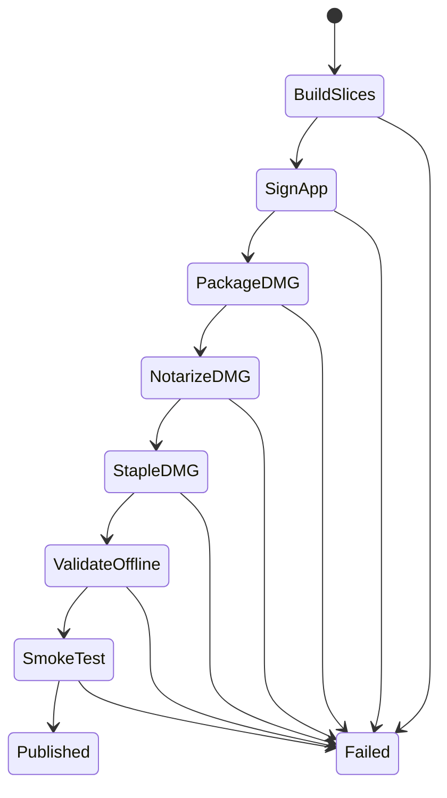

# 11 — Direct Distribution and Release

## Metadata

| Field | Value |
|---|---|
| ID | `11` |
| Classification | Required release |
| Specification status | Ready |
| Implementation status | Not started |
| Dependencies | `01`, `02`, `03` |

## Goal

Release any intentionally selected Displayora feature subset as an Intel-only,
Developer ID signed, Hardened Runtime app inside a notarized and stapled
downloadable DMG, with native Intel smoke evidence.

## Non-Goals

- No Mac App Store, Sparkle updater, automatic update service, or package
  installer.
- No release requirement for an intentionally omitted optional feature.
- No secrets committed to the repository.

## User Experience and States

The DMG presents `Displayora.app` and an Applications shortcut. A user drags
the app, launches it without Gatekeeper warnings, sees only included features,
and can read a release manifest listing included and omitted features.



## Requirements

- **DORA-11-001:** Release input is an explicit validated canonical feature
  list. Empty and any implemented subset are valid; unknown or unavailable
  features fail before building.
- **DORA-11-002:** Build one Swift 6 release binary for `x86_64` and verify the
  Intel architecture.
- **DORA-11-003:** Assemble `Displayora.app` with bundle identifier
  `com.displayora.Displayora`, a release-input version containing exactly three
  dot-separated non-negative integers, a positive decimal build number, and no
  development paths or unintended resources. Release input records the exact
  clean-worktree commit being packaged; a dirty or mismatched checkout fails
  before signing.
- **DORA-11-004:** Sign nested code and the app with Developer ID Application,
  Hardened Runtime, timestamping, and least-privilege entitlements. Ad-hoc
  signatures are rejected for distribution.
- **DORA-11-005:** Create a read-only compressed DMG named
  `Displayora-<version>-intel.dmg` containing only the app, Applications
  link, and presentation metadata.
- **DORA-11-006:** Treat the DMG as the outermost distribution container:
  submit that DMG with `notarytool`, require `Accepted`, staple and validate
  the ticket on the DMG, and assess the DMG with Gatekeeper. Do not claim that
  notarizing the outer DMG also staples a ticket to the contained app. Offline
  acceptance is verified by mounting the stapled DMG and launching its signed
  app on a clean, disconnected test account.
- **DORA-11-007:** Generate deterministic machine-readable JSON and
  human-readable text manifests beside the final DMG in the versioned release
  directory. Both record version, build, exact commit, DMG SHA-256,
  architectures, minimum macOS, included features, omitted features, signing
  identity fingerprint, and notarization request ID. The DMG remains limited
  to the app, Applications link, and presentation metadata.
- **DORA-11-008:** Run empty-subset and selected-subset automated checks plus
  native Intel launch smoke tests. Translated or non-Intel evidence is
  insufficient.
- **DORA-11-009:** Release failure preserves prior published artifacts, removes
  temporary credentials/files, and never uploads an unvalidated artifact.
- **DORA-11-010:** Release notes and DMG content are keyboard/VoiceOver
  understandable; installation requests no unnecessary permission.
- **DORA-11-011:** Every gate derives from included modules, so an omitted
  sibling feature cannot fail release.
- **DORA-11-012:** Independent Codex review and automatic repair must reach
  `Approved` before release implementation becomes `Verified`.

## Interfaces and Data Flow

The public release entry point is:

```sh
make release VERSION=<major.minor.patch> BUILD=<positive-integer> \
  FEATURES=<comma-separated-canonical-slugs> \
  SIGNING_IDENTITY=<developer-id-application-name> \
  NOTARY_PROFILE=<keychain-profile>
```

Release scripts validate those values before building. The signing identity
and notarization keychain profile are supplied through arguments; secret
material remains in Keychain and is read only by signing/notary tools. Neither
values derived from credentials nor verbose command traces are logged. Final
outputs are published atomically under `dist/releases/<version>/`.

```text
validated input -> Intel release build -> Intel-only app -> sign/verify
-> DMG -> notarize/staple/assess outer DMG -> native smoke tests
-> adjacent manifests -> atomic publish
```

Each stage consumes the validated output of the prior stage and writes to a
temporary release directory before atomic publication.

## Failure and Recovery

Any build, sign, notary, staple, Gatekeeper, checksum, manifest, or smoke
failure stops publication. Logs redact credentials. A rejected notarization
records the request ID and readable failure summary. Retrying begins from a
clean temporary directory; existing published files are unchanged.

## Accessibility and Permissions

DMG layout uses standard Finder semantics and a visible Applications link.
Release notes list included features plainly. Runtime permissions remain owned
by included specifications; distribution adds none.

## Platform Considerations

Minimum macOS is 13. Native Intel reports `x86_64`. The signed artifact verifies menu-bar
launch, Settings, no permanent Dock icon, included controls, and clean quit.

## Standalone and Omission Behavior

Release verification uses:

```sh
make verify-feature FEATURE=release
```

It checks release-script fixtures without signing or uploading. A real release
also verifies an empty optional set and the requested set. When a feature is
omitted, its module, UI, settings, commands, shortcuts, permissions,
resources, tests, and manifest “included” entry are absent; it appears only in
the omitted list. No sibling omission blocks a gate.

## Acceptance Criteria and Traceability

| Criterion | Requirements | Given / When / Then | Verification |
|---|---|---|---|
| `AC-11-01` | `DORA-11-001`, `DORA-11-002`, `DORA-11-003` | Given empty and selected feature sets, When release builds, Then a correct Intel-only app contains exactly the selected composition. | `TEST-11-01` |
| `AC-11-02` | `DORA-11-004`, `DORA-11-005`, `DORA-11-006` | Given valid credentials, When packaging completes, Then the app is Developer ID signed with Hardened Runtime, the outer DMG is accepted and stapled, Gatekeeper assessment passes, and the contained app launches offline without an unsupported app-stapling claim. | `TEST-11-02`, `MANUAL-11-02` |
| `AC-11-03` | `DORA-11-003`, `DORA-11-007`, `DORA-11-009` | Given valid input, a dirty checkout, success, and injected failures, When publication runs, Then only an exact clean commit publishes, adjacent manifests are complete, secrets are redacted, and prior artifacts remain safe. | `TEST-11-03` |
| `AC-11-04` | `DORA-11-008`, `DORA-11-010`, `DORA-11-011` | Given native Intel, When the DMG is installed, Then included behavior works accessibly and omitted features impose no gate. | `MANUAL-11-04` |
| `AC-11-05` | `DORA-11-012` | Given release implementation, When independent Codex review automatically repairs findings, Then zero Blocking findings and `Approved` precede `Verified`. | `TEST-11-05` |

## Verification

```sh
make verify-feature FEATURE=release
make check-architecture
make verify
make check-review SPEC=11
git diff --check
```

### Verification evidence

| ID | Required evidence |
|---|---|
| `TEST-11-01` | release fixture tests for empty/selected/unknown/unimplemented feature input, separate slice commands, exact architectures, plist values, and selected composition |
| `TEST-11-02` | command-construction and failure fixtures for nested signing, Hardened Runtime, DMG contents, `notarytool`, `stapler`, and Gatekeeper; fixtures never claim real notarization |
| `MANUAL-11-02` | Record signing verification, entitlements, Accepted request ID, outer-DMG staple validation, Gatekeeper assessment, clean-account offline launch, and artifact SHA-256. |
| `TEST-11-03` | version/build validation, clean/exact-commit guard, deterministic adjacent manifests, secret-redaction, injected-stage failure, cleanup, and atomic-publication tests |
| `MANUAL-11-04` | Install the final DMG on native Intel; record OS/hardware, process architecture, menu-bar/Settings/Dock behavior, included/omitted feature checks, accessibility pass/fail, and clean quit. |
| `TEST-11-05` | `make check-review SPEC=11` against the final approved review report |

For a real candidate run the documented `make release` command, verify app
signatures and Hardened Runtime, outer-DMG notarization and stapling,
Gatekeeper assessment, adjacent checksums/manifests, and native Intel/Apple
Intel smoke tests. Repeat the first-launch check from the stapled DMG using a
clean test account while disconnected from the network. Apple's
[custom notarization workflow](https://developer.apple.com/documentation/security/customizing-the-notarization-workflow)
is the normative platform reference. Review report:
`specs/reviews/11-direct-distribution-and-release-review.md`.

## Code Quality and Automatic Review

Follow [CODE_REVIEW.md](CODE_REVIEW.md): readable scripts and Swift 6,
explicit errors, safe temporary paths, redacted secrets, deterministic
manifests, no hidden failure or warning suppression, and no sibling coupling.
A different Codex reviewer examines the complete diff, release fixtures, and
native evidence; Codex automatically repairs in-scope findings and reruns
validation without weakening tests. Zero Blocking findings and `Approved` are
required for `Verified`.

## Author Self-Review

### Pass 1 — Completeness and User Safety

Added explicit feature input, secret handling, atomic publication, notarization
failure, offline Gatekeeper, checksums, and native smoke evidence.

### Pass 2 — Independence and Verifiability

Made every gate subset-aware and added empty-build, omission, accessibility,
manifest, failure-injection, architecture, and automatic review coverage.

## Pull Request Handoff

Open a dedicated draft PR with a plain-language distribution and risk summary.
