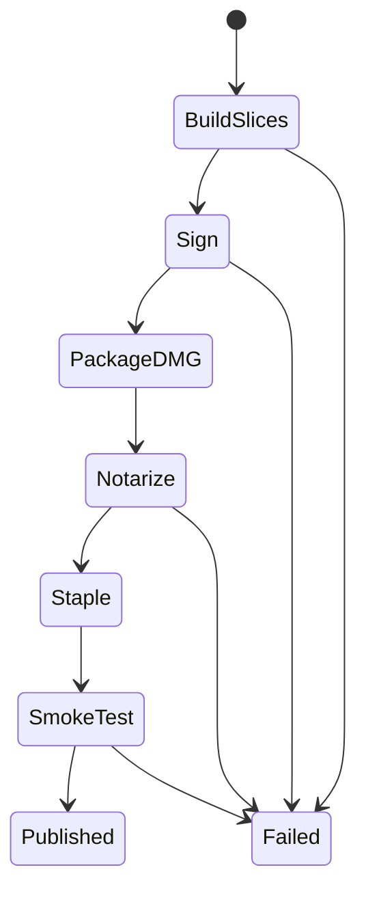

# 11 — Direct Distribution and Release

## Metadata

| Field | Value |
|---|---|
| ID | `11` |
| Classification | Required release |
| Specification status | Ready |
| Implementation status | Not started |
| Dependencies | `01`, `02`, `03` |

## Goal

Release any intentionally selected Displayora feature subset as a universal,
Developer ID signed, Hardened Runtime enabled, notarized and stapled app inside
a downloadable DMG, with native Intel and Apple Silicon smoke evidence.

## Non-Goals

- No Mac App Store, Sparkle updater, automatic update service, or package
  installer.
- No release requirement for an intentionally omitted optional feature.
- No secrets committed to the repository.

## User Experience and States

The DMG presents `Displayora.app` and an Applications shortcut. A user drags
the app, launches it without Gatekeeper warnings, sees only included features,
and can read a release manifest listing included and omitted features.



## Requirements

- **DORA-11-001:** Release input is an explicit validated canonical feature
  list. Empty and any implemented subset are valid; unknown or unavailable
  features fail before building.
- **DORA-11-002:** Build separate Swift 6 release slices for `arm64` and
  `x86_64`, combine with `lipo`, and verify exactly those architectures.
- **DORA-11-003:** Assemble `Displayora.app` with bundle identifier
  `com.displayora.Displayora`, version/build supplied by release input, and no
  development paths or unintended resources.
- **DORA-11-004:** Sign nested code and the app with Developer ID Application,
  Hardened Runtime, timestamping, and least-privilege entitlements. Ad-hoc
  signatures are rejected for distribution.
- **DORA-11-005:** Create a read-only compressed DMG named
  `Displayora-<version>-universal.dmg` containing only the app, Applications
  link, and presentation metadata.
- **DORA-11-006:** Submit the DMG for notarization, require Accepted status,
  staple the ticket to both app and DMG where supported, and validate
  Gatekeeper offline.
- **DORA-11-007:** Generate a machine-readable and human-readable release
  manifest with version, build, commit, SHA-256, architectures, minimum macOS,
  included features, omitted features, signing identity fingerprint, and
  notarization request ID.
- **DORA-11-008:** Run empty-subset and selected-subset automated checks plus
  native Intel and Apple Silicon launch smoke tests. Rosetta-only evidence is
  insufficient.
- **DORA-11-009:** Release failure preserves prior published artifacts, removes
  temporary credentials/files, and never uploads an unvalidated artifact.
- **DORA-11-010:** Release notes and DMG content are keyboard/VoiceOver
  understandable; installation requests no unnecessary permission.
- **DORA-11-011:** Every gate derives from included modules, so an omitted
  sibling feature cannot fail release.
- **DORA-11-012:** Independent Codex review and automatic repair must reach
  `Approved` before release implementation becomes `Verified`.

## Interfaces and Data Flow

Release scripts accept version, build, selected features, signing identity,
and a notarization keychain profile through arguments/environment. Secrets are
read only by signing/notary tools and never logged.

```text
validated feature list -> two release slices -> universal app -> sign/verify
-> DMG -> notarize/staple/assess -> native smoke tests -> manifest + publish
```

Each stage consumes the validated output of the prior stage and writes to a
temporary release directory before atomic publication.

## Failure and Recovery

Any build, sign, notary, staple, Gatekeeper, checksum, manifest, or smoke
failure stops publication. Logs redact credentials. A rejected notarization
records the request ID and readable failure summary. Retrying begins from a
clean temporary directory; existing published files are unchanged.

## Accessibility and Permissions

DMG layout uses standard Finder semantics and a visible Applications link.
Release notes list included features plainly. Runtime permissions remain owned
by included specifications; distribution adds none.

## Platform Considerations

Minimum macOS is 13. Native Intel reports `x86_64`; native Apple Silicon
reports `arm64`. Both use the identical signed artifact and verify menu-bar
launch, Settings, no permanent Dock icon, included controls, and clean quit.

## Standalone and Omission Behavior

Release verification uses:

```sh
make verify-feature FEATURE=release
```

It checks release-script fixtures without signing or uploading. A real release
also verifies an empty optional set and the requested set. When a feature is
omitted, its module, UI, settings, commands, shortcuts, permissions,
resources, tests, and manifest “included” entry are absent; it appears only in
the omitted list. No sibling omission blocks a gate.

## Acceptance Criteria and Traceability

| Criterion | Requirements | Given / When / Then | Verification |
|---|---|---|---|
| `AC-11-01` | `DORA-11-001`, `DORA-11-002`, `DORA-11-003` | Given empty and selected feature sets, When release builds, Then a correct universal app contains exactly the selected composition. | `TEST-11-01` |
| `AC-11-02` | `DORA-11-004`, `DORA-11-005`, `DORA-11-006` | Given valid credentials, When packaging completes, Then Developer ID, Hardened Runtime, DMG, notarization, stapling, and Gatekeeper checks pass. | `TEST-11-02`, `MANUAL-11-02` |
| `AC-11-03` | `DORA-11-007`, `DORA-11-009` | Given success and injected failures, When publication runs, Then the manifest is complete, secrets are redacted, and prior artifacts remain safe. | `TEST-11-03` |
| `AC-11-04` | `DORA-11-008`, `DORA-11-010`, `DORA-11-011` | Given native Intel and Apple Silicon, When the same DMG is installed, Then included behavior works accessibly and omitted features impose no gate. | `MANUAL-11-04` |
| `AC-11-05` | `DORA-11-012` | Given release implementation, When independent Codex review automatically repairs findings, Then zero Blocking findings and `Approved` precede `Verified`. | `TEST-11-05` |

## Verification

```sh
make verify-feature FEATURE=release
make check-architecture
make verify
make check-review SPEC=11
git diff --check
```

For a real candidate additionally run the documented release command, verify
signatures, notarization, stapling, Gatekeeper, checksums, manifest, and native
Intel/Apple Silicon smoke tests. Review report:
`specs/reviews/11-direct-distribution-and-release-review.md`.

## Code Quality and Automatic Review

Follow [CODE_REVIEW.md](CODE_REVIEW.md): readable scripts and Swift 6,
explicit errors, safe temporary paths, redacted secrets, deterministic
manifests, no hidden failure or warning suppression, and no sibling coupling.
A different Codex reviewer examines the complete diff, release fixtures, and
native evidence; Codex automatically repairs in-scope findings and reruns
validation without weakening tests. Zero Blocking findings and `Approved` are
required for `Verified`.

## Author Self-Review

### Pass 1 — Completeness and User Safety

Added explicit feature input, secret handling, atomic publication, notarization
failure, offline Gatekeeper, checksums, and native smoke evidence.

### Pass 2 — Independence and Verifiability

Made every gate subset-aware and added empty-build, omission, accessibility,
manifest, failure-injection, architecture, and automatic review coverage.

## Pull Request Handoff

Open a dedicated draft PR with a plain-language distribution and risk summary.
