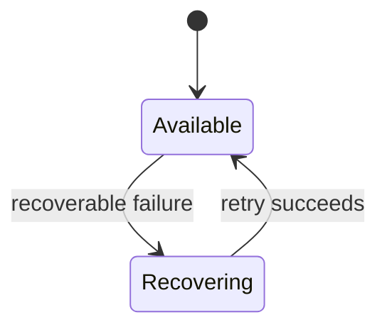

# NN — Feature Name

## Metadata

| Field | Value |
|---|---|
| ID | `NN` |
| Classification | Required platform / Optional standalone / Required release |
| Specification status | Drafting |
| Implementation status | Not started |
| Dependencies | Explicit specification IDs or None |

## Goal

State the user-visible and architectural outcome.

## Non-Goals

List behavior deliberately outside this specification. Resolve scope; do not
leave open questions.

## User Experience and States

Describe novice-friendly labels, feedback, loading, empty, unsupported, error,
and recovery behavior.

## Requirements

Use stable IDs such as `DORA-NN-001`. Include accessibility, permissions,
failure/recovery, Intel/Apple Silicon, standalone verification, and omission.
Resolve every implementation-relevant choice: bounds and units, timing and
retry limits, precedence, persistence keys and invalid-value handling, user
copy, concurrency ownership, adapter boundaries, and observable success or
failure. Do not leave an implementation agent to choose product behavior.

## Interfaces and Data Flow

Name module boundaries, public types, ownership, concurrency isolation, and
the direction of data. Optional features may depend only on Specifications
01–03 and external system frameworks, never sibling features.

## Failure and Recovery

Define typed failures, user feedback, bounded retry/revert behavior, state
restoration, and crash/termination considerations.

## Accessibility and Permissions

Define labels, keyboard and VoiceOver behavior, contrast/motion needs,
permission timing, denial, and revocation.

## Platform Considerations

Explain macOS 13+, Intel, Apple Silicon, HDR, sleep/wake, hot-plug, and private
API differences that apply.

## Standalone and Omission Behavior

State how `make verify-feature FEATURE=<name>` builds, tests, and composes the
feature alone. State precisely what is absent when the feature is omitted.

## Acceptance Criteria and Traceability

Every requirement maps to a Given/When/Then criterion and an automated or
manual test identifier.

| Criterion | Requirements | Given / When / Then | Verification |
|---|---|---|---|
| `AC-NN-01` | `DORA-NN-001` | Given … When … Then … | `TEST-NN-01` |

## Verification

List exact automated commands and exact manual procedures. Define the test
target or fixture behind every `TEST-NN-XX` and the steps and recorded evidence
behind every `MANUAL-NN-XX`. Include focused tests, full regression,
formatting, architecture, strict concurrency, standalone composition, omission,
and native Intel and Apple Silicon evidence where hardware behavior is
involved. Automated tests must not claim to prove behavior that requires real
hardware, permissions, signing identities, notarization credentials, or
Gatekeeper.

## Code Quality and Automatic Review

Implementation must comply with [CODE_REVIEW.md](CODE_REVIEW.md). It uses
idiomatic, straightforward Swift 6; clear names and focused types/functions;
value types by default; protocols only at meaningful boundaries; declarative
SwiftUI; `@MainActor` UI state; safe `Sendable` values; typed recoverable
errors; and isolated, availability-checked private APIs. It prohibits
premature abstraction, unnecessary generics, oversized view models,
sibling-feature coupling, `try!`, unexplained force unwraps, silent error
suppression, crash-based control flow, and warning suppression.

Before commit, a different Codex reviewer examines the specification, complete
diff, tests, shared interfaces, and all validation results and writes
`specs/reviews/NN-<feature>-review.md`. Codex automatically repairs all
in-scope blocking findings and all scope-preserving non-blocking readability,
idiomatic Swift, safety, accessibility, and maintainability findings, then
reruns focused and full-regression checks. Tests and acceptance criteria must
not be weakened, warnings or errors hidden, or exclusions broadened.

Review and repair repeat until all acceptance criteria pass, no blocking
findings remain, and the independent reviewer records `Approved`. Product
decisions or specification changes block implementation. Only an approved
result may set implementation to `Verified` and be committed.

## Author Self-Review

### Pass 1 — Completeness and User Safety

Record findings and concrete revisions.

### Pass 2 — Independence and Verifiability

Record findings and concrete revisions.

## Pull Request Handoff

The coordinator, not the specification author, opens the dedicated draft
human-review pull request using [PR_TEMPLATE.md](PR_TEMPLATE.md). The PR
description must start with a plain-language summary and record the
specification decisions, user/developer impact, review focus, dependency or
stack base, and validation results. This section is a handoff reminder only;
the final PR URL and human review state live on GitHub.
